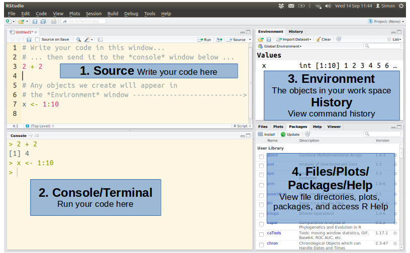
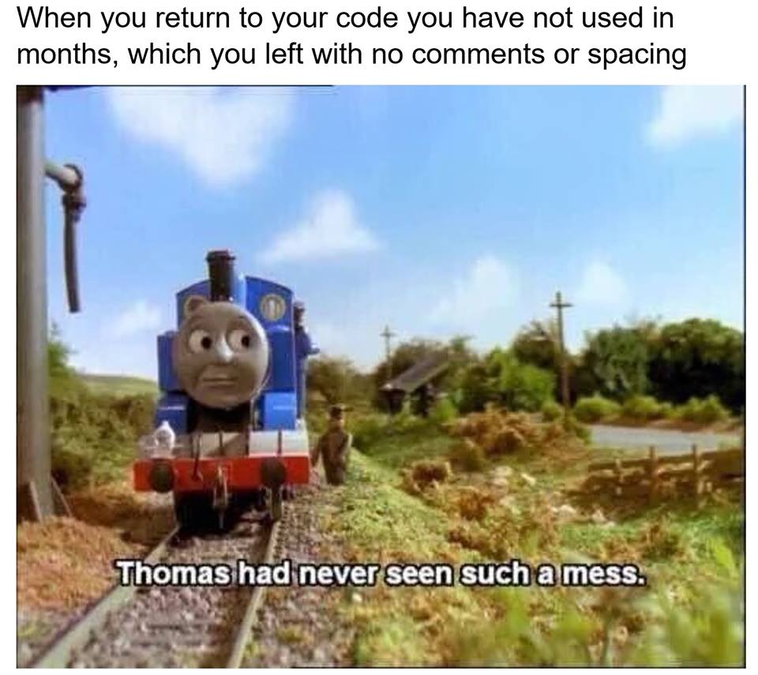
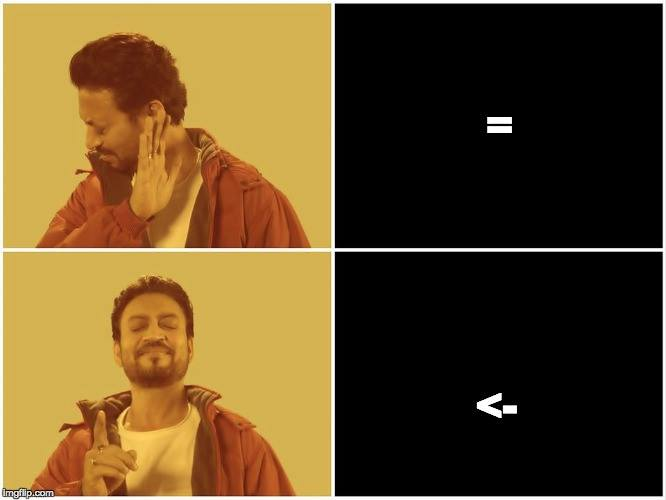
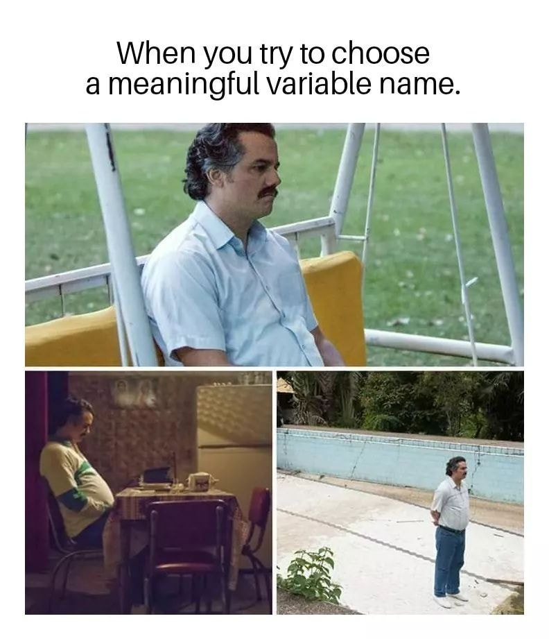

```{r setup, include=FALSE}
knitr::opts_chunk$set(include = TRUE,eval = FALSE)
```

*Post-graduate Program in Wildlife Biology and Conservation - National Centre for Biological Sciences, Bengaluru*

This worksheet comprises explanatory text, worked examples and problems for solution. Please feel free to discuss any and all of it with your classmates, but do work independently on your solutions.

**Topics covered**: getting started with RStudio; in-built functions; objects; operators; vectors and matrices; indexing; getting help

**Interactive session 1**: 16th September 2020, 09:00AM -11:00AM IST

**Interactive session 2**: 18th September 2020, 09:00AM -11:00AM IST

**Submission deadline**: 19th September 2020, 11:59PM IST

**Submission**: Save your final R script in the format ‘first name_last name_WS1.R’ and email this file to both Anand (aosuri@ncf-india.org) and Akshay (akshaysurendra1@gmail.com) by the given deadline.


## 1.1 R and RStudio - installation instructions

**`R`** is a statistical programming language that we will be using through **RStudio**, a *graphical user interface* (GUI). In case you are still facing issues installing R or RStudio, please reach out to one of us right away.

## 1.2 Introduction to R, RStudio and why R, functions and objects

Reference: Opening presentation (September 11th, 2020) [\underline{link}](https://drive.google.com/file/d/1fcBmRMB3KOo3JJbCg1_6Sl7lYv4ryXzR/view)

Recommended reading: How does a computer work [\underline{link}](http://www.intro2r.info/unit1/how-computers-work)

## 1.3 RStudio layout (Source, Console, Environment, Files)

Open your RStudio window. Click on ‘File’- ‘New File’- R Script’.  Now,  carefully go over each of the 4 panes you see in front of you. What are these panes called? (See figure 1)





**Programs** (also called scripts) are routines that *do certain tasks on* **objects** using **functions**; each line of a program is colloquially called **code**. We will write programs in the `Source` window (usually top-left), and observe the results in the `Console` window (usually bottom-left). However, we can also run programs in the `Console`, and see the results immediately but we will avoid running programs in the `Console` directly. This is because: - R immediately runs any code in the `Console`, but in the `Source` window, R waits for the user to click `Run`\+ (top-right of `Source` window) - R scripts in the `Source` window can be saved along with comments* but there in no clean way to save what you type in the `Console`

\* Comments are lines in the code that R skips, so you can type anything in the comments and R doesn’t care. We usually explain the code using comments, in what is called annotation. Comments begin with `#` (hash or pound) symbol, and R ignores everything after it  *in that line*

\+ Once you have finished your program, you can tell R to run the entire program (or parts of the program by selecting those lines) by clicking the Run button on your top right of your `Source` window. Think of `Source` as your main answer sheet and your `Console` as the rough work column.

## 1.4 Writing your first program

In your `Source` window, type the following \- 
```{r}
a <- 5 # The number 5 is stored in object `a` 
b <- 78 # The number 78 is stored in object `b`
sum(a,b) # The function sum() takes two objects `a` and `b` as input and gives ____ 
# as output (run code to check)
c <- sum(a,b) # The output of function sum() is not saved in the above line
# here it is saved in an object `c`
c
print(c) # function print() takes the object c as input and gives ____ as output
#(run code to check)
```

\- and click the `Run` button on the top. Often, it is good practice to select lines of code (called `chunks`) and run them individually, and in sequence, and observe the output, if any, in the `Console` window.

That's it! You have your first program!

Now let’s understand the saved code line by line: 

  1. `a <- 5` creates an *object* whose name is a and which contains the number 5. The `<-` symbol is called an assignment operator: everything on the right of the assignment operator goes into (i.e., gets assigned to) the object present in the left of the assignment operator 
  2. `b <- 78` does the same thing as above. Can you see the environment pane on your top right? What do those two columns contain? 
  3. `sum(a,b)` is a function that acts on both the objects. The name of the function is `sum()`

*Note: all functions are written with parentheses or round brackets `()`, to indicate to R and to us that they are different from objects *

  4. Each function has to have an output and almost always has an input. Can you identify the input and output above? The `sum()` function takes the input objects `a` and `b` and outputs some data, which we have instructed R to assign to  a new object `c`.
  
  5. Finally, the print() function takes one input object `c` and displays the data stored in that object in the console below
  
  
Note1: If there is an error, we find it out using what is called `debugging`. We select each line or even sections of a line of code and run them separately. You could click Run or use the shortcut of selecting lines and pressing `Ctrl/Cmd + Enter` to run the code

Note2: You may have noticed that R has ignored everything after the # sign in each line - try to modify that text and see the output. Does it change? Note how comments are trying to explain what each line does

*Adding comments is good coding practice, especially when you share the code with others and your later self (Figure 2)*



## 1.5 Saving your work

Before proceeding further, let’s save your R Script (`Ctrl/Cmd + S` or save option on the top left of your console window) in an easily accessible location. We will be writing **a lot of scripts** in this course, so it's good practice to provide an informative and easily understandable name. Give this script a name that tells us it is your work on worksheet 1 -- use your First name_Last name_WS1.R (e.g., `Richard_Meinertzhagen_WS1.R`) *[Who is this Richard](https://en.wikipedia.org/wiki/Richard_Meinertzhagen)?*. 

When you click the save button, you will be asked to save it in your computer with an extension of `.R`

Eextensions are a way for the computer to identify which file works with which program \- for eg, a file with `.doc` will work with MS-Office for instance. Don’t forget to add the .R at the end of your file name in case your computer hasn’t done so already.

Once you have saved the script, quit RStudio (‘File’- ‘Quit Session’ or click the cross on the top-right of your main RStudio window). You will see a notification asking whether you want to save your workspace -- click ‘No’ for now, and we will discuss the implications of this during the next session.

Then, reopen RStudio. If all has gone according to plan, your saved script should still be visible in the source panel, while the control and environment panels have been reset.


## 1.6 Objects and data - integer, char, double, logical

Continue working in your saved R script right below the code you wrote in the previous section. Make sure to periodically save your script (`Ctrl/Cmd + S` or ‘File’- ‘Save’)

We have an intuitive idea of what objects and data are (if not, refer to class notes [PDF](https://drive.google.com/file/d/1fcBmRMB3KOo3JJbCg1_6Sl7lYv4ryXzR/view)) - let's now use them.

```{r}

d1 <- 45.1
d2 <- 56.2
d3 <- 'A'
d4 <- 'what'
d5 <- TRUE
d6 <- T
class(d1)
class(d2)
class(d3)
class(d4)
class(d5)

```

What do you see when you run this code?

`class()` is an R function that takes an object as an input and outputs what class of data it contains or what class of object it is.

Note1: `d5` and `d6` are identical because R has a *shorthand* for `TRUE` - you can simply write `T` and R will understand what you mean (the text is of a different colour in RStudio)

Note2: R is case-sensitive, which means uppercase and lowercase letters are treated differently

Note3: In `d3` and `d4`, we have used double-quotes **"** but we can also use single-quotes (however, remember to not get confused between single quotes and the *grave key*, below the tilde **~** sign in the top-left)

Note4: `a <- "z"` stores the character (**data**) z in object a, but `a <- z` stores an object `z` in another object `a` \- R will give an error if `z` doesn't exist

We've only shown three data types here, as seen in class. If you're curious about the fourth type, see [\underline{this}](https://www.stat.berkeley.edu/~s133/factors.html#:~:text=Factors%20in%20R%20are%20stored,a%20vector%20of%20factor%20values.) \- we will come to this later

## 1.7 Operators on objects - math

Functions do certain tasks on objects, but some (simple) tasks can be carried out with what are called operators.

\underline{Arithmetic operators}: two numeric inputs and one output of the same data type. For example, we used a function to add `a` and `b` in the previous example, but we could also do -

```{r }
a <- 5
b <- 78
a+b # addition
a*b # multiplication
a-b # subtraction
a/b # division
a^3 # exponent
a %% b # modulus
a : b #sequence of numbers from a to b, both a and b included

a + b / 5
a/5 + b
(a + b) / 5
a + (b / 5)

```

Do the outputs from the first half make sense? What is a modulus operation? Why do the last 4 lines of code yield different outputs? 
Hint: what is BODMAS? See [\underline{ here}](https://www.mathsisfun.com/operation-order-bodmas.html)

Do the different outputs from the last 4 lines now make sense?

## 1.8 Operators on objects: logical, relational, assignment

\underline{Relational operators}: two numeric inputs and one *logical* output

```{r }
a <- 5
b <- 78
a < b  # less than
a > b  # greater than
a <= b # less than or equal
a >= b # greater than or equal
a == b # equal to (notice two == symbols)
a != b # not equal
```

What outputs do you see? What data type(s) are they?

Note1: *Equal to* is tested using **two `=`** symbols, not one. That's because one `=` symbol can also be used as an assignment operator (below)
Note2: In all programming languages, the `!` exclamation symbol indicates **negation** or NOT: `!=` are together a *not equal to* operator

\underline{Assignment operators}: 
here, one can use the `<-` symbol to assign data/object on the right side of the `<-` symbol to the object on the left side of  the `<-` symbol. This is equivalent to using the `=` symbol but we almost always use `<-` symbol by convention, except within *named function arguments* (more below, also Figure 3)



\underline{Logical operators}: one or two numeric/character inputs and one logical output

```{r }
a <- 5
b <- "xyz"
a & b # not useful
a | b # not useful
!a    # not useful

(a >= 5) & (b == "xyz")
(a > 5) & (b == "xyz")
(a > 5) | (b == "xyz")
(a > 5) & (b == "z") 
(a > 5) | (b == "z") 
!(a >= 5) #useful

```

What output do you see? Identify the three kinds of operators in each of the lines of code.

Why have we used parentheses?

Note: Operators sometimes help you write shorter code than functions (eg. `a + b` is more parsimonious than `sum(a,b)`), but the importance of functions will become clear when you begin working with larger volumes of data.


## 1.9 Operators on objects - in-built functions: so many!

Operators have limited capacity. However, R provides hundreds of in-built functions, in the 'factory version' of R, wrapped into what is called the `base` package.

Some useful built-in functions are listed below. Run each line to see the output in the `Console` and modify the numbers to see how the output changes. Save the output of each function into an object with a name of your choice - print the contents of these objects to check if it matches the previous output.
 
```{r }
seq(from = 0, to = 100, by = 20)
seq(from = 0, to = 100, by = 2)
seq(from = 0, to = 100, length.out = 10)
seq(from = 0, to = 100, length.out = 100)

c(4,56,432,1,56,6,78) # very important
# c - stands for combine

log(x = 100, base = 10)
log(x = 256, base = 2)

exp(x = 4)

```

What output do the `seq()` functions give?

The `seq()` function creates a *sequence* (hence the name) starting from the `from` data/object and ending at the `to` data/object. The data/object supplied to `by` is the *step-length*.

`c()` combines or concatenates data/objects together - **very important function**

Notice here that each function has *named function arguments* within parentheses. The inputs that functions take in (usually data or objects) are called *arguments*. These arguments have an internal name within a function that you can use to tell R which object/data is which argument. If you don’t provide the name, R will decide and that may be wrong in some cases.

For example, you want to create a sequence from 10 to 20 with steps of 1, `seq(10,20,1)` will give you the right answer but `seq(20,10,1)` will give you an error. If you use named arguments, you can avoid this - `seq(from = 10, to = 20, by = 1)` and `seq(to = 20, from = 10, by = 1)` gives the same result.

How do you know what the named arguments are? You use the help feature in R. *Every* function in R has a help file associated with it, that in RStudio, is displayed in its own Help window (usually a tab in the bottom right).

If you Run this line of code \- `?seq()`, you will see a help pop-up. You can also go to the help tab and type your search in the top right, but that’s slow. This help file is not the easiest to read, but we recommend going over the following:
  - Description
  - Arguments (inputs)
  - Value (output)
  - Examples.
The *Details* section is sometimes easy to understand but otherwise cryptic.

**` ?`** question mark followed by function name gives you the help file -- e.g., `?log()`.

The various named arguments in each function are listed below arguments. In many simple functions (like *`c()`*) no named arguments are needed but are good practice in more complicated functions.

Typing out named arguments is cumbersome. Almost always, we use  [*\underline{code completion}*](http://sirselim.github.io/Introduction-to-R-and-RStudio/chapter3/section4.html). Move your cursor between the parentheses of a function and hit `Tab` - you should see a list of arguments. Move across arguments using up or down arrow and a context-menu in yellow you will describe all/each argument. This is the same as **`?`** help option but much easier to see. To pick an argument, press enter. If there are more than one arguments, add comma and press `Tab` to repeat.

This procedure can be done for all function names in R - if you forgot the `seq()` function but knew it began with letter `s`, you can type `s` followed by `Tab` to find all functions beginning with s and select your function.


## 1.10 1-D vectors and 2-D matrices

So far, we've assigned numeric, character or logical data to an object.

Vectors, are 1-dimensional objects, where each object refers to a long chain of data, *all of the same data type*

In fact, we have used vectors before! the combine *`c()`* and *`seq()`* functions are two (out of many) ways to assign such a series of data values to one object (Example: `tmp <- c(4,56,432,1,56,6,78)`)

Observe the following examples of assignment and execute them:

```{r}

dat <- c(45,4,2,45,66)
yo <- c("abc","def","what","notfair","alright")
hmm <- c(TRUE,FALSE,TRUE,TRUE,TRUE,FALSE,TRUE,FALSE,FALSE)

```

Each element of a vector can be accessed using an index or position, which is the address of an element in the long chain. The address is always a natural number that begins at one. run `c(5:50)` and you will see the list of numbers but also some numbers within square brackets `[ ]` in the left. These are the positions of elements closest to the edge.

Run the following and observe the output in the `Console`

```{r}
ff <- c(1,2,3,3,4,4,5,6)
ff[1]
ff[6]
ff[9]
ff[0]

# We can also overwrite entire vectors or separate elements of the vector
ff[5] <- 45
ff[1] <- 1
ff <- c(60:69)

```

Similarly, there are 2-dimension matrices that can be defined a few ways:

```{r}

# empty matrices
matrix()
matrix(data = NA,nrow = 10,ncol = 5)

#matrix with data
matrix(data = c(50:60),nrow = 5,byrow = TRUE)
matrix(data = c(50:60),nrow = 5,byrow = FALSE)
a <- c(60,78,90,77)
b <- c(61,79,91,78)
cbind(a,b)
rbind(a,b)

```

What does the above output look like in each case? What is the difference between `cbind()` and `rbind()` function in terms of output? Use the help command  to learn more about these functions.

\underline{Important Note}: **`NA`** is a special kind of *data* in R - it means **nothing** - not zero, nothing or empty. It is very useful to store certain data as `NA` instead of `0`. For example, you *did not* see a Darjeeling Woodpecker in a bird survey. You can store its abundance as zero. But if you *did not do the survey* (say because of a snow storm), what was the abundance of the bird?
No way of knowing.
In such cases, we store data as `NA`. See the help window for `NA`(also `NaN`) for more details

Lots of in-built functions act on vectors and matrices. Try out these functions below, and infer the task they perform using the output you see. Then use the help feature to check if you were correct and learn more about the arguments

A. \underline{Vectors}

```{r}
somename <- seq(from = -10,to = 30,length.out = 81) # a vector
a3 <- sum(somename)
a3 <- mean(somename)
a3 <- length(somename)
a3 <- class(somename)
a3 <- median(somename)
a3 <- min(somename)
a3 <- max(somename)
a3 <- sort(x = somename,decreasing = TRUE)
a3 <- rev(somename)
a3 <- abs(somename)
```

What do each of these functions above do?



**Variable**: it is used synonymously with an object although it usually refers to columns in a data frame

B. \underline{Matrices}

```{r}
tt <- c(4,5,6,7,7,6,5,4,1.2,44,5,9,-8,-3.14,-10)
tm1 <- cbind(c(56:65),seq(from = 0.5,to = 5,by = 0.5),c(99,NA,56,4.5,1,2,3,4,5,NA))
tm2 <- cbind(c(56:65),seq(from = 0.5,to = 5,by = 0.5),c(99,0,56,4.5,1,2,3,4,5,8))
sort(tt)
length(tt)
sum(tt)
mean(tt)
sd(tt) # standard deviation
median(tt)
range(tt)

```

Do you understand how `tt`, `tm1` and `tm2` are created?
What output do you see from these functions?
What output do you see when you replace the input for all these functions with a) `tm1` and b) `tm2`?

Why is the output from `tm1` so weird? Can you fix it?

(Clue: use code-completion to identify a crucial argument, open help and read what values that argument takes as input and what it does, and then use that argument to get numeric outputs as before)

Do the outputs of `tm1` and `tm2` match? Why? Why not?

You may have matrices of more than 2 dimensions, but we will cap it at two for now.

Change the data values assigned to `tt` and `tm1` and make it `character` data type \- how does it affect the output?
Can you create `tt`, `tm1` and `tm2` using a combination of data types? What do you notice about the output? [\underline{Clue}](https://www.oreilly.com/library/view/r-in-a/9781449358204/ch05s08.html#:~:text=When%20you%20call%20a%20function,that%20the%20function%20will%20work.&text=Values%20are%20converted%20to%20the,%3C%20complex%20%3C%20character%20%3C%20list.)

Run the functions `dim()`, `rowSums()`, `colSums()` and `t()` on objects `tt`, `tm1` and `tm2` \- what output do you get? Can you infer what those functions do? Check help to learn more.

\underline{Matrix indexing}

What do the following lines of code give us?

```{r}

kk <- matrix(data = c(701:800),nrow = 20,ncol = 5)
kk[1,5]
kk[5,1]
kk[20,1]
kk[1,20]
kk[4,6]
kk[0,0]
kk[0]

```

Do the outputs make sense? Check by printing *`kk`* in the `Console` (see section 1.4 to recollect how)
Why do some of them give errors?

We can also use indexing to refer to entire column(s) or entire row(s):
```{r}
kk <- matrix(data = c(701:800),nrow = 20,ncol = 5)

# single row or column
kk[4,]
kk[,1]
kk[5,]

# several continuous rows or columns
kk[4:5,]
kk[,1:4]

# several discontinuous rows or columns
kk[c(4,5,19),]
kk[,c(3,4,5)]

# without rows or columns (add a minus sign)
kk[,-4] #without 4th column
kk[,-5]


kk[c(4,5,19),1:3]
kk[,1:4]
kk[-c(5,9,11),-c(1:2)]
kk[-c(5,9,11),-1:2]

```

Why does the last line give an error?
Refresher: Everything within `[]` brackets are indices, that are addresses to elements within the object. Indices in R are positive whole numbers, starting from *one*.

In the BODMAS rule above, where does the `:` operator fall? It doesn't, so it is evaluated at the end. Thus, the last line tries to print all elements of object kk belonging to all rows *except* 5th, 9th and 11th row and *all columns except minus1th, 0th, 1st and 2nd column* - such indices are not allowed and hence the error pops up. If you wanted to only remove the 1st and 2nd column, you can enclose it in parentheses, and BODMAS rule will apply \- 
`kk[-c(5,9,11),-(1:2)]`


## 1.11 Nested functions

```{r}

a <- 56 + 7
b <- log(x = a,base = 10)
b <- log(x = a/5 + 1,base = 10)
# operators within functions

# eg1 
a <- 63
b <- log(x = a, base = 10)
c <- sqrt(x = b)
# this is same as
c <- sqrt(x = log(x = a,base = 10)) # nested
# function within function

# eg2 (not nested)
ty <- seq(from = 8,to = 80,by = 8)
ty.se <- sd(ty)/sqrt(length(ty))
# operator around function output

ty.se1 <- sd(ty)/sqrt(length(ty) - 1)
ty.se2 <- sd(ty)/(sqrt(length(ty)) - 1)
ty.se3 <- sd(ty)/sqrt(length(ty)) - 1

# example 3 (nested)

jj <- c(5:11)
k <- length(x = seq(from = min(jj),to = max(jj),by = 0.2))
k

```

Why do the three lines of code in example 2 give three different results? Why is example 2 *not nested*?
What is the output of eg 3?


## 1.12 Vectorized operations

R supports *vectorized* operations - if you want to run a function on every element of an object (say 1000 elements in a vector or matrix), you don't need to run it separately for each element (1000 times) \- applying the function on the object applies it automatically on all elements.

For example, 
```{r}

a1 <- c(10,100,1000,10000,100000)

a2_1 <- log(x = a1[1],base = 10)
a2_2 <- log(x = a1[2],base = 10)
a2_3 <- log(x = a1[3],base = 10)
a2_4 <- log(x = a1[4],base = 10)
a2_5 <- log(x = a1[5],base = 10)
```

is a labourious way of applying a function (`log()`) on each element of object `a1`

Instead we can do it all at once using R's vectorized capability - *by applying the function `log()` along the object `a1`*

```{r eval=FALSE}

a1 <- c(10,100,1000,10000,100000)
a2 <- log(x = a1,base = 10)
```

What data is stored in `a2`?

\pagebreak

# Problem set to be submitted (**graded**)

Convert the following tasks to R commands and run them:

  1. Create a vector `g` that stores even numbers from 10 to 20 in a sequence
  
  2. Find the logarithm (base-2) of each element of vector `g` in just one line of code (Clue: *vectorize*)
  
  3. Can you implement 1) and 2) above in one line of code?
  (Clue: nested functions)
    
  4. Run the following code *snippet* (another word for a block of code) in your R script \-
```{r}
  matrix(data = rnorm(n = 32,mean = 0,sd = 2),nrow = 4,ncol = 8)
```
  
\underline{Next class}: read more about the `rnorm()` function and what it does - this is not required to answer the questions below
  
  5. Save the above matrix in an object and use appropriate indices to extract and print the following:
  
    a. even-numbered columns
    b. odd-numbered rows
    c. both even-numbered columns AND odd-numbered rows
    
  6. In the above matrix, *check* if the following statements are true or false (Clue\- use one or more of these three operators: relational/logical/assignment):
  
  a. Is the 1st element of row 1 less than the 8th element of row 1?
  b. Is the 4th element of column 1 more than the 6th element of column 1?
  (Report any result you get, error or otherwise)
    
  7. Learn what the function `substr()` does using the help command (and also the internet) and answer the following questions:
  
  a. Create a character vector object with 6 elements, and each element must hold the name of a bird native to your country (data type: ?)
  b. Identify and print the first 2 letters of each element in this vector
  c. If you used 6 lines of code to implement 7-b, can you do it in 1 line? (clue \- *vectorize*)
    
  
