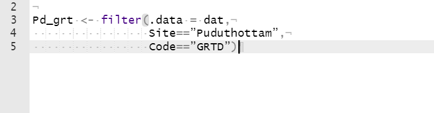
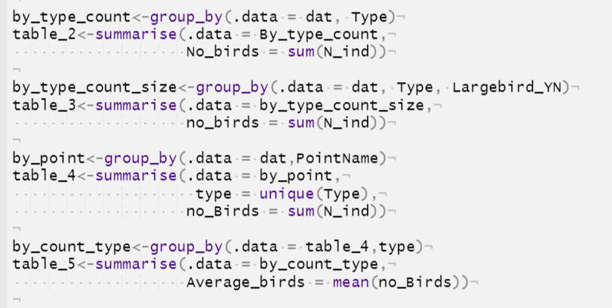
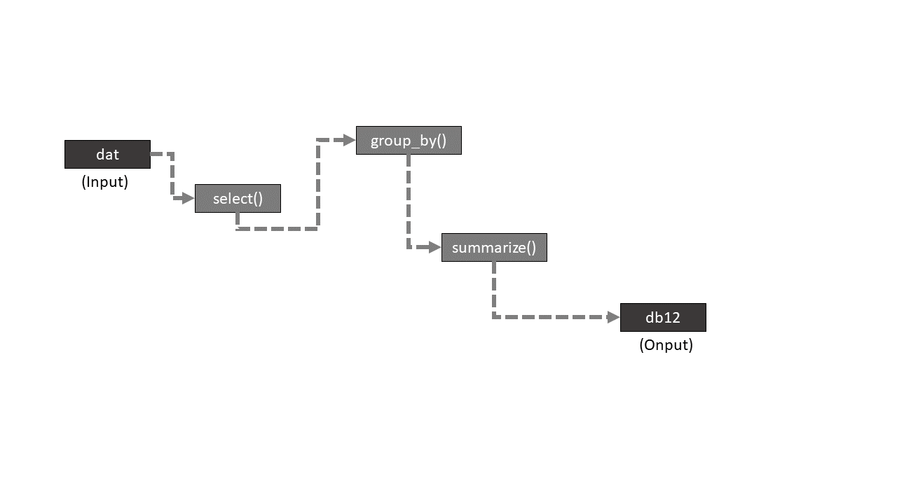
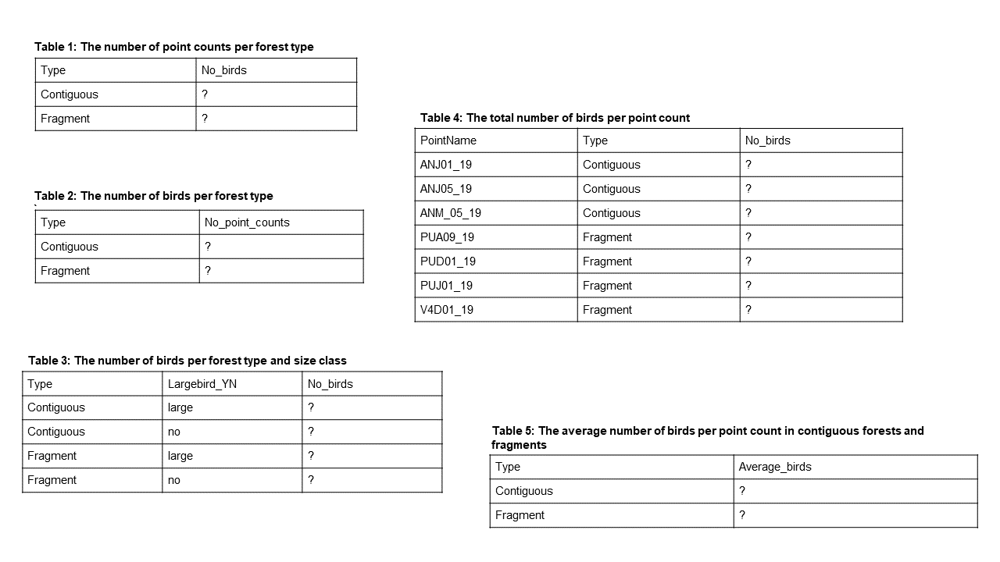

```{r setup, include=FALSE}
knitr::opts_chunk$set(echo = TRUE, eval = FALSE)
```
*Post-graduate Program in Wildlife Biology and Conservation*
*National Centre for Biological Sciences, Bengaluru*

This worksheet comprises explanatory text, worked examples and problems for solution. Please feel free to discuss any and all of it with your classmates, but do work independently on your solutions.

**Topics covered**: installing R packages; working directories; data frame fundamentals; read file as a data frame; inspect data; subset data using `[,c()]` or `dat$<colname>`; `dplyr` functions - `mutate(), select(), filter(), group_by(), summarize()`; factor data type; nested `dplyr` functions; pipe `%>%` operator; practice with a real data set

**Interactive session 1**: 23th September 2020, 09:00AM -11:00AM IST

**Interactive session 2**: 25th September 2020, 09:00AM -11:00AM IST

**Submission deadline**: 26th September 2020, 11:59PM IST

**Submission**: Save your final R script in the format ‘first name_last name_WS2.R’ and email this file to
both Anand (\underline{aosuri@ncf-india.org}) and Akshay (\underline{akshaysurendra1@gmail.com}) by the given deadline.

## 2.1 Installing R packages - install `dplyr` and `readr`

So far, we have used in-built functions in R. We can also download packages (bundled functions) from [\underline{CRAN}](https://cran.r-project.org/web/packages/available_packages_by_name.html) (the R `app-store`)

Packages can be installed from the internet using the `install.packages()` function, with the name of the package within double quotes as the argument. Get on as stable an internet connection as possible, and then run the following lines of code to install the very useful `dplyr` and `readr` package in RStudio

```{r}

install.packages("dplyr", dependencies = TRUE)
install.packages("readr", dependencies = TRUE)

```

You should see a lot of things happening as RStudio downloads the packages from the internet and installs it on your computer. If  you already have  the package, this line *updates* the package (you may have to restart RStudio in that case, depending on the prompt)

Packages are bundles of functions. *But some functions may use functions that are a part of other packages*. By specifying `dependencies = TRUE`, we ensure that RStudio installs not just the target package (`dplyr` in this case), but all other packages on which dplyr functions might depend (e.g., `dplyr` depends on `ellipsis`, `lifecycle`, `Rlang` and a bunch of other packages [link](https://cran.r-project.org/web/packages/dplyr/index.html)).

Once installation is complete and you see a blinking cursor in the console window, run the line `library(dplyr)` in your `Source` window to *load the package*. This ensures that the downloaded package `dplyr` is brought from your computer into your R environment. What does the help option for `dplyr` tell you?

Task: install the *`beepr`* package from CRAN as described above. Load the package and run the function `beep()` bundled within the `beepr` package \- what happens?


## 2.2 Data frame fundamentals

Vectors and matrices are all good but in the real world, data frames are what we'll use most. Data frames are like matrices - two dimensional objects with rows and columns - but in a data frame, each column can contain data of different types (e.g., numeric, character, logcial)

Let's create a data frame in different ways - 
```{r}
dat <- data.frame() 
# empty data frame is created using the data.frame() function and stored
# in the object dat
dat # prints object to the console

```

When you print `dat`  to the console, what do you see?

Defining a data frame with data:
```{r}
dat <- data.frame(biomass = c(300,350,400,380,490,495,550,270),
                  dead_YN = c(TRUE,FALSE,TRUE,TRUE,FALSE,FALSE,TRUE,FALSE),
                  dominant_species = c("teak","eucalpytus","sal","pine","oak",
                                       "casuarina","spruce","ironwood"))
dat
```

When you print `dat`  to the console, what does it say?

Let's practice using index values to access data from this dataframe  - Can you print the following values in the console:
  1. Even rows 
  2. Odd columns

We can also `coerce` (does that programming term sound familiar? [link](https://www.oreilly.com/library/view/r-in-a/9781449358204/ch05s08.html)) a matrix or a vector into a dataframe. Coercing is possible using a series of `as.<something>()` functions\*

```{r}
v1 <- seq(from = -10,to = 0,by = 0.8)
v2 <- letters[1:13]
v3 <- matrix(data = rnorm(100,0,1),nrow = 20,ncol = 5)
dd1 <- as.data.frame(v1)
dd2 <- as.data.frame(v3)

## also coerce data frames back to a matrix - 
dd3 <- as.matrix(dd2)
# Does this work?

```

The above `as.<>()` functions convert the input object **as** an output object of a specific type

## 2.3 Wait what are letters? - *constants*
Let's print them and see

```{r}
letters 
LETTERS 
```

But which one is it? Is it an object or a function?
What does code completion say? (tab at the end of `letters`)
Okay that's interesting. Can we learn more? Let's check help - 


Turns out R has a few built-in *constants* - these are just special kinds of data but data that you can't change. You can use them, make copies of them in an object and change those objects.
Okay back to creating a dataframe from matrices and vectors:

```{r}

v1 <- seq(from = -10,to = 0,by = 0.8)
v2 <- letters[1:13]
v3 <- (v1 < (-3.2)) # what does this statement do?
# If you're not sure, first run the right side and see what's printed in the
# console

m1 <- cbind(v1,v2)
m2 <- cbind(v1,v3)
m3 <- cbind(v2,v3)
m4 <- cbind(v1,v2,v3)
m1
m2
m3
m4 # Why do m1-m4 look so different? observe carefully

# What kind of objects are m1 to m4?
# (Hint: use a function that returns the type of object, or class of object)

d1 <- data.frame(c1 = v1,
                 c2 = v2)
d2 <- data.frame(c1 = v2,
                 c2 = v3)
d3 <- data.frame(c1 = v2,
                 c2 = v3)
d4 <- data.frame(c1 = v1,
                 c2 = v2,
                 c3 = v3)
d1
d2
d3
d4 # Why are these d1-d4 different? How different are they from m1-m4?

```

`m1,m2,m3,m4` are matrices and each of them contain the **same** data type while `d1,d2,d3,d4` are data frames that contain *different* data types. *However, even a dataframe has the same data within each column*

How do you know, given some object, whether it's a matrix or a data frame? If it's a data frame, how do you know which column stores what kind of data? We can use the `str()` function

```{r}
str(d4)

```

What do you see in the console? Is this informative?
`str()` is called the *structure* function - read about it in help (don't worry, there's too much detail in there that isn't useful to us). When you supply vectors or matrices to the `str()` function, what is the output? Is it useful? (more in class)

We may also want to see our data frame visually, the way we're used to, like excel. How do you do that?
```{r}
view(d4)
```

Does the `view()` function also work on vectors and matrices? Check

Often, our data sets are *HUGE* and we may want to check parts of a data frame. Two useful functions are - 

```{r}

head(d4)
tail(d4)

```

What output do you see? Can you replicate this using index values?

One other thing \- we've so far thought of data as 1-D vectors or 2-D matrices or data frames. But data frames are well suited to understand as follows:

  1. Each row corresponds to one observation
  2. Multiple rows string together to form a data frame
  3. Each observation can be just one one value, say canopy cover, and those can be stored as either a vector, matrix or data frame
  
```{r}
canopy_cover <- c(45,67,76,78,90,10)
v4 <- matrix(data = c(45,67,76,78,90,10),ncol = 1,nrow = 6)
colnames(v4) <- "canopy_cover"
v5 <- data.frame(canopy_cover = c(45,67,76,78,90,10))

```

`canopy_cover`, `v4` and `v5` all hold the same information, as an `nx1` object

  4. Each observation may also include two or more values, with same or different data types. For instance, each observation may include counts of 6 species of birds : 
  
```{r}
v6 <- matrix(data = c(1,0,3,0,0,5,1,0,3,0,0,5,1,9,11,10,3,1),ncol = 3, nrow = 6)
colnames(v6) <- c("purple_sunbird","purple_cochoa","purple_heron")

v7 <- data.frame(purple_sunbird = c(1,0,3,0,0,5),
                 purple_cochoa = c(0,0,1,0,1,0),
                 purple_heron = c(1,9,11,10,3,1))

```
  
Or may include information with different data types, e.g. species name AND if it was heard/seen:
```{r}
v6 <- matrix(data = c(1,0,3,0,0,5,
                      1,0,3,0,0,5,
                      1,9,11,10,3,1,
                      "H",NA,"S", NA, NA,"S",
                       NA, NA,"S", NA,"H",NA,
                      "S","S","S","S","S","H"),
             ncol = 6, nrow = 6)
colnames(v6) <- c("purple_sunbird_nos","purple_cochoa_nos","purple_heron_nos",
                  "purple_sunbird_SH","purple_cochoa_SH","purple_heron_SH")

v7 <- data.frame(purple_sunbird = c(1,0,3,0,0,5),
                  purple_cochoa = c(0,0,1,0,1,0),
                   purple_heron = c(1,9,11,10,3,1),
                 purple_sunbird_SH = c("H",NA,"S", NA, NA,"S"),
                  purple_cochoa_SH = c(NA, NA,"S", NA,"H",NA),
                   purple_heron_SH = c("S","S","S","S","S","H"))
```

You can now see how data frames are better to hold this kind of data rather than matrices

  5. You also see that each row is an observation, each column is a `variable`. Variables are vectors that hold the same kind of data, and usually hold one attribute or all rows/cases in your data
  6. R lets you pull out each `variable`  in two ways - one using `named` indexing, and another using the `$` sign. You can also use `numbered` indexing, but then, you need to first find out what the column number corresponds to your **variable** of interest is
  
Let's print Purple Cochoa numbers and seen/heard information in three possible ways:
```{r}

v7[,c(2,5)] # numbered indexing
v7[,c("purple_cochoa","purple_cochoa_SH")] # named indexing
# you can used code-completion to do this:
# within the c() function, press tab to look at all the columns present
# use up-down arrows to select the column(s) that you're interested in

v7$purple_cochoa
v7$purple_cochoa_SH
# dollar-sign lets you pull one variable at a time
# also code-completes - press tab after the dollar sign, up-down- arrow and tab

```


Source: https://ebird.org/checklist/S54162329

  7. *\underline{Subsetting Data}* - It's often important to extract *parts* of your data - a subset. We've already learnt how to do it using index numbers. For instance, you may **subset** purple heron data and store it in another object in these ways
```{r}
pher <- v7[,c("purple_cochoa","purple_cochoa_SH")]
pher <- v7[,c(2,5)]

```

To **subset** observations, you can use the row index, say `v7[c(1,3,6),]` will give you the 1st, 3rd and 6th observation. However, we usually select observations based on certain conditions (Eg. observations with more than 10 birds, etc) - more soon.

\* Note: Whenever you see angular brackets `< >` with some text within, it means that those values are not fixed and may take a a value depending on the user. For instance, type `as.` in your console and press `Tab` to see all the possible functions that begin with `as.`

## 2.4 Real datasets - but before that, working directories

As you must have realized, typing out data and saving it manually in objects is time consuming and not at all feasible. You typically save it in a spreadsheet software, like MS-Excel, and then import it into `RStudio`. Within R, you can clean, transform, analyze and visualize this. But before we go there, we need to be able to tell RStudio which folder contains the file we're interested in.

Can you think of another reason to link RStudio to a folder?
Well, if RStudio generates some **output** - tables or figures - we need a folder into which we can instruct RStudio to save it.

Thus, RStudio is linked to a particular folder for two reasons - to *read* files from your computer into RStudio, and to *write* files from RStudio and into your computer.

Run the following function - 
```{r}
getwd()
```

What do you see? You see a *path* to a certain folder. By default, in Windows, it's the *Documents* folder. This means that a file kept in your "Documents" folder can be read into RStudio directly, and any table or plot you want to save, will get saved in that folder. This folder, is called the *working directory* - every time you're working on R, this directory is 'open'. You can also see this working directory's contents to the right of your RStudio window, the `Files` tab.

Use help to learn more about `getwd()` function.

R lets you change that folder. You can use the `setwd()` function to do that. In Windows, enter a string, for example: \"`C:/Users/<Name>/Desktop/`\" , within parentheses in the `setwd()` function. But wait! this won't work, because \<Name\> is usually specific to your computer. And the path varies.

You can provide a custom path by starting at the *root* directory (the bottom most in the hierarchy, which is usually `C:/` in Windows or `/home` in Mac) and use tab-complete to navigate to the folder of your choice.

For eg - type `setwd("C:/")` and press tab after the `/` slash, use arrows to move and press Tab again select a folder, and keep moving. When you decide that you are within a folder of your choice, stop. What you have is a *path* of your *working directory* and the setwd() changes your working directory to the *path* supplied within setwd(""). Below the console window, you can see the path shown in grey.

This may be very confusing if you've never used *paths* before, but we'll show you in class - it's very straightforward (more in class)

## 2.5 Input a file as a data frame (the tidy way)

Download your file (sent via email) into a folder of your choice (ideally, create a separate folder for this R course) and use `setwd()` to let RStudio know where to look for this file.

*Then, install and load the `readr` package in RStudio, which contains functions for importing data*. Once this is done, run the following:

```{r}
dat <- read_csv("worksheet2_dataset.csv")
```

If all went well, the specified data file would have been imported into your R environment using the `read_csv()`* function and stored within the object `dat`.
Check the Environment tab to confirm that the object `dat` has appeared there (if your environment already contained a dat, this step would have simply overwritten it). Further, R would have parsed the data and made a guess regarding the type of data contained in each column. Let us view the data and check if R got the parsing correct on this occasion.

```{r}
view(dat)
```

First, a little information about the dataset. These are data on birds, collected from a site in the Western Ghats


  - Birds were sampled using a method called [\underline{point counts}](https://www.youtube.com/watch?v=reqjCHScWWk) -- i.e., specific locations at which birds are counted for a standard length of time. Each such location has a unique name (column `PointName`)
  - Point count stations are situated within sites (column `Site`), with one or more point counts per site.
  - Sites represented either one of two types of forests (column `Type`): small forest `fragments` or large `contiguous` patches
  - At each point count station, bird species seen (columns: `BirdID` and `Code`) and numbers of individuals (column: `N_ind`) were recorded
  - Bird species were also classified as being large-bodied or not based on published information (column: `Largebird_YN`)
  - The column N_ind contains numeric data, and during import `R` should have recognised it as `col_double` (a number format). The remaining columns contain character data, which R would have recognised as `col_character()`. *Check this for yourself in the console window right below your data import command.*

\* *Note:* CSV is an abbreviation for **Comma Separated Values**. This means that the data are stored in a format that uses commas as separators, indicating to the computer where one data element ends and the next one begins (More in class - this and other separators).

Once we have successfully imported the data and are satisfied with the data types (character, numeric) identified by R, let us proceed with our `dplyr` journey

\* *Note2:* You must have noticed another thing - when you print the data frame `dat` in your `Console` - 
```{r}
dat
```
- you don't see rows and rows of data, you only see ~eight rows. And it looks... different. There's a greyed-out **data type** below each column name. And above the column names, its says `A tibble: n x m` where n and m are the rows and columns respectively - do they match the numbers shown? Why not?

What we have here, `dat`, is a **`tibble`**. Tibble is a data frame and more - the more part has a lot to do with making our lives as programmers convenient (e.g., by showing the data type for each column in `dat`)

You can also manually convert your data frames into tibbles. Remember `v7` from above? you can convert it to a tibble like so:
```{r}
v7_tib <- as_tibble(v7)
```

## 2.6 Make a new column `mutate()` in `dplyr`

`mutate()` is a function in the package `dplyr` (pronounced *dee-ply-urr*). How does `mutate()` work?
It takes the tibble as the first argument, and the second (and subsequent) argument is *new*, created as *\< new_column_name \> = \< value \>*

```{r}
dat_a <- mutate(.data = dat,Year = 2019)
```

Here, the new column `Year` holds the value `2019`. Since R is a vectorized language, *all* rows in the tibble within the column `Year` will have the same value of `2019`.

You can also create a new column that does some computation on existing columns. For example, let's create a new column that holds the logarithm of the number of birds, and save it as a new object:
```{r}
dat_new <- mutate(.data = dat, log_N_ind = log(N_ind))
```

Note here, that a new column is created, called `log_N_ind` that holds the logarithm of the column `N_ind`

Each row will have a different value here, and because R vectorizes, the function `log()` is applied to *all* elements of the column/variable/vector `N_ind`

\underline{Note 1}: Notice that the argument in `mutate()` starts with `.` (dot) - we'll know why soon, but lets remember the difference and move on for now. 

\underline{Note 2}: **(Important)** Note that arguments within the `mutate()` function already know that any *name* used within the function parentheses, refers to a variable, and any variable - newly created (like `log_N_ind` above) or old (like `N_ind`) - are columns of the tibble assigned to `.data`

Here, R automatically knows that `N_ind` is a column in `dat`, and `log_N_ind` is a new column that will be created in `dat`

\underline{Note 3}: The list of arguments in most `dplyr` functions are limitless (hence code completion shows `...`). You can keep creating new columns separated by commas; you may even create a new column using another newly created column:

```{r}
mutate(.data = dat,
       log10_N_ind = log10(N_ind),
       log2_N_ind = log2(N_ind),
       scalefac = exp(log10_N_ind)/exp(log2_N_ind))` 
```

What is the resulting tibble from this line of code? Does it make sense? 
  
Q: Can you create another column in `dat` called `scaled_N` that scales (divides) the observed number of individuals by 100?

## 2.7 Subset rows `filter()` in `dplyr`

Let's create a new tibble named `Andi` which contains only rows corresponding to the site `Andiparai`. This can be done using a `filter()` function:

```{r}
Andi <- filter(.data = dat, Site== "Andiparai")
Andi
```

Does Andi contain what we want it to contain?

How does the function `filter()` work? Like mutate, the first argument is `.data`, which stores the tibble on which we will operate. The subsequent arguments are all **expressions** that result in **TRUE/FALSE**.
Run the line `Site == "Andiparai"` in your `Console` \-- What does it give you?

An error?

*Correct!* This is because `filter()` knows where `Site` is coming from: from the tibble `dat`. Outside of `filter()`, you need to tell R where `Site` is, otherwise R will get confused (Did this make sense? revise Note 2 above and if it's not clear, as us in class)

You can use the `$` operator to tell R that `Site` is within a tibble `dat` - 
```{r}
dat$Site == "Andiparai" 
dat[,"Site"] == "Andiparai"
```

Do you see a list of `TRUE`s and `FALSE`s? These go into the filter function, and **only the rows matching TRUE are in the output**

Like `mutate()` above, you can have **multiple expressions** within `filter()` - how does R deal with more than one vector of `TRUE`/`FALSE` (logical) values? **It does the AND operation**

For example, `filter(.data = dat, Site=="Andiparai",Largebird_YN=="large")` creates a subset tibble where  `Site` is *Andiparai* AND `largebird_YN` is *large*. How do you create a `filter` using an OR operator? You can avoid the comma and replace it with the OR operator - **`|`**

In short, when you have multiple expressions with `filter()` the *comma is interpreted as an AND* **`&`** *operator* (yes, we can also avoid the comma and use the AND `&` operator) and we can use the **`|`** operator to compare two or more expression outputs as **OR**

One last thing - filter() and mutate() may seem different from the functions you know so far, and they are, but they have *complete backward compatability* - all base-R functions we know so far works on tibbles and output objects of `dplyr` functions

For instance, these lines of code work:

```{r}
dat_b <- mutate(.data = dat, newcol = N_ind*3.14, rootcol = sqrt(N_ind))
dat_c <- filter(.data = dat_b, newcol <= 7, rootcol > 1)
dat_c2 <- filter(.data = dat_b, newcol <= 7 & rootcol > 1)
dat_c3 <- filter(.data = dat_b, newcol <= 7 | rootcol > 1)
sum(dat_c[,"newcol"])
sum(da_c$newcol)
```

What do you see above? can you see how base-R functions like sum() works well on columns/variables/vectors within newly created output tibbles?

Q: How many rows does this tibble `dat_c` contain (hint:`nrow`)?

Q: What is the difference between `dat_c`, `dat_c2` and `dat_c3`

Q: create a new tibble named `Pd_grt` which contains only rows corresponding to observations of [\underline{Greater Racket-tailed Drongo}](https://ebird.org/species/grtdro1) in the site *Puduthottam*.
Try this by yourself first, and refer to the solution below in case you get stuck.
How many rows does this tibble contain?



## 2.8 Select or deselect certain columns using `select()` in `dplyr`

`dplyr` also provides a simple function called select that lets to select one or more columns by name, and deselect (remove) one or more columns
```{r}
dat_d1 <- select(.data = dat,Code)
dat_d1
dat_e1 <- select(.data = dat,-Code) #minus sign
dat_e1
```

Do you understand how `dat_d1` and `dat_e1` are created?
`select()` can also take more than one column as new arguments, just like `mutate()` and others; While deselecting, each of those columns must have a minus sign

```{r}
dat_d2 <- select(.data = dat,Code,Largebird_YN,PointName)
dat_d2
dat_e2 <- select(.data = dat,-Code,-Type,-Nind) #minus sign
dat_e2

dat_e3 <- select(.data = dat,Code:Largebird_YN)
dat_e3

```

How did `dat_e3` work?
It is also possible to select consecuitive columns (i.e. ones that are next to each other) using a colon `:` operator - here all columns from `Code` up to `Largebird_YN`, both of these included, are selected and stored in dat_e3

*Note*: The output object will have columns in the order that they are provided in `select()` - thus, `select()` can also be used to reorder columns (by giving all columns within select but in a sequence of your choice)

## 2.9 Create a summary using `summarize()` in `dplyr`

The `summarize()` function provides a summary of all or a subsets of rows in a tibble. To find the mean number of birds detected across all observations, we can do - 
```{r}
summarize(.data = dat, avgno = mean(N_ind))
```

The above function looks remarkably similar to the `mutate()` function above. However, keep in mind that while mutate does vectorized operators, such that the output has as many elements as the input (for eg, `log_N_ind = log(N_ind)` has as many rows as `N_ind`), summarize necessarily **collapses** the rows, through a summary function. Here, we have used `mean()` as the summary function.

Can you similarly use the `summarize()` function to find:

  - lowest value of `N_ind` in the dataset
  - highest value of `N_ind` in the dataset
  - Median number of  birds observed acoss all observations
  - Total number of birds observed across all observations
  
Of course, you may say what's the use of this, can't I directly select that column and apply the function? In the next section, we'll learn its true power.


## 2.10a Working with data - group_by and summarize

Let us first take a minute to become familiar with the grouping structure of the present dataset \-

  - each point count contains a group of bird observations
    - each site contains a group of points
      - each habitat type contains groups of bird observations, points and sites

**One of the most common operations we might perform with such data is to calculate summaries for different groups and make comparisons across groups.**

For example, you may want to calculate the average number of species detected per point, or ask how average species per point differs between fragments and contiguous forests.

Before diving into dplyr’s delicious collection of summary functions, *let us first perform a few of these summaries ‘by hand’*.

Open the bird data file (`worksheet02_dataset.csv`) using your preferred spreadsheet software (MS Excel, LibreOffice Calc or Google sheets) and use filters and any other tools you may be familiar with to complete the following tables (for your reference only; no need to submit).

Copy tables from this [\underline{link}](https://docs.google.com/spreadsheets/d/1vBeRC7H0jmqj045lzio6DKvA7Sz8aZImN3nslNmnSH0/edit?usp=sharing) onto your computer's spreadsheet software

We will now implement each of these tables using corresponding `dplyr()` functions in R - basically a combination of `group_by()` and `summarize()`

We know how `summarize()` works. Let's learn about `group_by()`
Let's run the following line - 
```{r}
dat <- read_csv(file = "worksheet02_dataset.csv")
By_type <- group_by(.data = dat, Type)
By_type
```

You will see `By_type` looks exactly like `dat` (whichever argument has been supplied to the .data = argument) except for one crucial difference - above the column headers, greyed out, is a line that says: `Groups: <grouping-varible> [number]` 

This indicates that internally, R has done some grouping.

To understand further we need to understand a fourth data type (the one we kept aside in lecture 1) - **factors**.

## 2.11 A factors segue

Factors are ordered data that are internally numeric but coded as texts. There's a lot to say about factors and because they are slightly confusing at the beginning, the internet is full of resources. Here are some starters - [**\underline{link1}**](https://www.datamentor.io/r-programming/factor/), [**\underline{link2}**](https://swcarpentry.github.io/r-novice-inflammation/12-supp-factors/index.html)

(More about factors in class)

## 2.10b Back to group_by and summarize

When you supply a column to `group_by()`  (In the above case it's `Type`), that column is converted internally to a factor temporarily. Then, the tibble is internally split into different groups, where each group is identified by the fact that they all share the same *level of a factor*. By itself, the output object of a `group_by()` is not very useful. In fact, to run other `dplyr()` operators on it, it is often advised to first ungroup it using `ungroup()`  and then use that output for further analysis.

Just like other dplyr functions, you can add as many columns to your `group_by()` as your dataset allows. If you have, say 2 columns and they have 2 and 4 levels respectively, there will be a totally of 2x4=8 internal groups that will be created.

```{r}
group_by(.data = dat,Type,Largebird_YN)
```
How many groups are created above?

But `group_by()` is very powerful with `summarize()`. How do you implement the calculation in `Table 1`, done by hand, using `group_by` and `summarize` ?


```{r}
# assuming you've already read the .csv file into dat
by_type <- group_by(.data = dat, Type)
Table_1 <- summarize(.data = yb_type,
                     No_point_counts = n_distinct(PointName))
```

Here, you see that `Table_1` takes a `group_by()` output object, and summarizes by creating a new column `No_point_counts` that holds the number of distinct `PointName`s created separately, for **each** group in `By_type` - that's why `.data` in `summarize()` here takes an already grouped object.

Finding the number of unique elements in a column is among the more common operations. Thus, dplyr provides a ready function that can only be used within the dplyr() universe (i.e) not by itself, called `n_distinct()` used above

Just like `n_distinct()` there is also a function called `n()` - this can also be implemented only within a few `dplyr` functions. What does `n()` do?

Replace `n_distinct()` with `n()` and see what happens: note that `n()` doesn't take any arguments (don't understand what this sentence means? More in class); also check help for `?n()`

Can you now write `group_by()` and summarize() combination functions to implement Table 2,3,4 and 5? Try doing it by yourself - was this your approach?



Print outputs of Table_1 through Table_5 carefully, from your own version or using the version shared above. What do you see? 
Go over the help of `group_by()` and `summarize()` again to get a good idea of some details.

## 2.12 Nesting dplyr functions and practice

It's very easy to nest dplyr functions together - 

```{r}
db12 <- summarize(.data = group_by(.data = select(.data = dat,PointName,
                                                  Site,N_ind), PointName,Site),
                  median_birds_perpt = median(N_ind))
db12

```

Does the output of db12 make sense? If this nesting doesn't make sense, think like a computer. Go to the innermost function `select()` and evaluate that first. Write down the output of that function in the margin, and now use that as the *input* for the next innermost function, `group_by()` and so on.

Use Figure 2 as a heuristic:


*Practice:*

Using our dataset on birds, can you use use the following combinations of functions in a nested manner?
  1. select and filter
  2. select, filter and summarize
  3. filter and summarize
  4. filter, mutate and summarize
  5. select and summarize
  6. mutate, select, filter and summarize
  7. group_by and summarize
  8. group_by, filter and summarize
  9. group_by, mutate, select, filter and summarize
  10. group_by, select, mutate and summarize
  
Note: The order of functions can be moved around - some combinations may not be possible (eg. group_by after summarize is not possible in simple scenarios)

## 2.13 Nesting made easy - pipe operator

As you might have realized, with complex datasets, we may need to do lots and lots of nested `dplyr` functions
We can simplify that by using the **`pipe`** operator. This is an extremely powerful operator, and found in the **`magrittr`** package.

First install the magrittr package as you would any package available on CRAN, and then load the package into R.

The pipe operator is this: **`%>%`** or percentage greater-than percentage. It's annoying to type this each time, so you can use the shortcut: `Ctrl/Cmd + Shift + M`

Consider the previous nested example:

```{r}
db10 <- 
  summarize(.data = group_by(.data = select(.data = dat,PointName,Site,N_ind),
                             PointName,Site),
                  median_birds_perpt = median(N_ind))

```

This exact same expression can be rewritten using the pipe operator as: 

```{r}

db11 <- dat %>% 
  select(.data = ., PointName, Site, N_ind) %>% group_by(.data = .,
                                                         PointName,Site) %>% 
  summarize(.data = .,median_birds_perpt = median(N_ind))

```

This looks much more elegant! Also, note that the sequence of expressions is exactly as the computer would evaluate it, in Figure 2.

You can read this line of code as: 

object `dat` *then* 
  function `select` *then* 
    function `group_by` *then* 
      function `summarize`

Note how the .data argument takes a dot **`.`** as the input. However, we also see that the `%>%` operator ensures that all functions are connected, and there is no ambiguity about where the .data gets its data object from. THus, we can ignore `.data = .` entirely and R will still understand it correctly (more in class)

Piping can be made more readable be indenting after each pipe operator like below:

```{r}

db12 <- dat %>% 
  select(PointName, Site, N_ind) %>% 
  group_by(PointName,Site) %>% 
  summarize(median_birds_perpt = median(N_ind))

```

Exercise: Repeat every single dplyr() function throughout this worksheet, nested or not, using the pipe `%>%` operator

Q: Can you use the `%>%` operator for non-dplyr functions? non-tibble objects? Try (and more in class)


## 2.14 Writing data frames into files on your computer

After all this hardwork, it is now time to save your output tables that you can open in other software, share, put in a presentation etc.
We can use the `write_csv()` function within `readr` package to do this:

```{r}

db13 <- dat %>% 
  select(PointName, Site, N_ind) %>% 
  group_by(PointName,Site) %>% 
  summarize(median_birds_perpt = median(N_ind))

write_csv(x = db13,path = "path/tablenameA.csv")
# replace path with the appropriate path

```

no path means the object `db13` will be written to a CSV within your current working directory; Name of the CSV file is at the end of your path, followed by `.csv` - here the file is `tablenameA.csv`

Practice: Can you write a few tibbles or data frames to your desktop? Do you see any difference when you supply data frames or tibbles as the first argument in write_csv()? Why/why not?

\pagebreak

# Problem set to be submitted (**graded**)

0. Installing a package. We've so far used two packages `dplyr`,`readr` and `magrittr` - but we will be using a few more, all linked to each other. Together, they are all wrapped in a super package called `tidyverse`. Going forward, we can simply load this `tidyverse` instead of all the other packages individually. For this question, install the `tidyverse` package from CRAN (check that you have a stable internet connection - this might take a while) and make sure dependencies are also installed. Check if tidyverse is installed by loading the package and running the function `tidyverse_packages()`

Field data is usually large and messy, and can be parsed in many ways to give different insights. For this problem set, we will use data that is associated with a paper by Karkarey et al (2017) [Alternative reproductive tactics and inverse size-assortment in a high-density fish spawning aggregation](https://link.springer.com/article/10.1186/s12898-017-0120-5). Science runs largely on public money and always on trust and thus, sharing data with tax payers and fellow scientists are, respectively, the right thing to do. One place to access a lot of such datasets associated with published journal articles is [\underline{Data Dryad}](https://datadryad.org/stash).

The data set from [\underline{this dryad location}](https://datadryad.org/stash/dataset/doi:10.5061/dryad.m3069) has been sent to you (`male_activitybudget.csv`) over email. Reading the paper and then going over the data is recommended to get a feel for the data, although not necessary to answer the following questions.
  
  1. load the data frame as a tibble into RStudio by first setting the working directory and print the first three rows of the dataset in the console. Can you print the last 6 rows of the tibble using a function and not indexing?
  
  2. Identify the column names that begin with the letter s using code completion. Select those columns (i) without using `dplyr` functions (ii) using `dplyr` functions without `%>%` operator (iii) using `dplyr` functions AND `%>%` operator; save each of these to new objects. Check whether there are any differences between them.
  
  3. Create a neew timme using filter to retain observations where *State* is `Movement` and `new state` is `Rest`. In this object, what is the mean and median time spent by each individual?
  
  4. In the original dataset, identify the individual that was observed the longest (hint: `sum()` is an in-built function in R, `group_by()` may help) 
  
  5. In the original dataset, identify which individual spends most time roving (hint: we only care about rove state, all else can be removed for this Q)
  
  6. In the original dataset, did the researchers spend more total time observing fish in 2013 or 2014? Can you substantiate that with numbers computed using `dplyr` functions?
  
  7. In the original dataset, What is the mean time spent in each new state?
  
  8. What is the mean time spent in each new state in 2013 and 2014 separately? What is the mean time spent in each new state in slope and shelf habitat?
  
  9. Can you calculate the standard deviation (or spread) of time spent in each new state in the two habitat categories?
  
  10. Save the New state column to an empty vector using indexing and `$` operation, and coerce that vector back into a dataframe, and then to a tibble
  
  11. Save this data frame as a CSV both in the working directory and on your desktop
 
## Bonus section: pivot_wider() and pivot_longer() 
**This is \underline{entirely optional} \- we will be going over pivot_longer() and pivot_wider() in class, worksheet3 or both, subject to time**

Read ?help and on the internet about `pivot_wider()` and `pivot_longer()` functions and how they work. Using what you've just learnt, and everything else in this worksheet answer this:

  B1. Rearrange the original dataset to stretch it out, such that there are columns for each `new state` and the value for each column is the time spent in it. First do this by hand, filling in this template:
  
  
  
  Remove `State` but retain other columns, and save it in a tibble called `bonus_dat`. Convert it to a CSV and write it to your working directory. Go over the numbers carefully. Have you implemented it correctly? (In other words, does each observation match the data correctly?)
  
  B2. Can you repeat all these steps in reverse, and get back the exact same tibble from the .csv that you've just saved? (Hint: if you used pivot_longer() in B1, you'll have to use pivot_wider() and vice versa)
  


