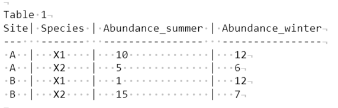
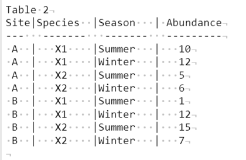

```{r setup, include=FALSE}
knitr::opts_chunk$set(echo=TRUE, fig.width=4, fig.height=4, eval=TRUE, warning=FALSE)
```

# Section 1: Revising `dplyr`

In the previous worksheet, we learnt some key dplyr functions - `select()`, `filter()`, `mutate()`, `group_by()` and `summarize()`. In this worksheet, we will revise these and learn a few more important dplyr functions, before proceeding to data plotting.

For all of these exercises, we will be using the `SuryavanshiBhatia2014_dataset.csv` dataset. These data are results from interviews done by two researchers Schaller and Mat (real names withheld) understanding people's attitudes towards snow leopards. Each row corresponds to one person who was interviewed. We have also shared a metadata file that explains what each column is. You can find more information in the [\underline{manuscript}](https://conbio.onlinelibrary.wiley.com/doi/full/10.1111/cobi.12320) and in the full dataset associated with this paper uploaded on Data Dryad [\underline{here}](https://datadryad.org/stash/dataset/doi:10.5061/dryad.6f8p0). Note that \underline{the dataset we've given you is a subset of the original dataset uploaded online}.

*Before proceeding, please change your working directory to the appropriate folder and input this file into an object called `wsdat`*.

```{r echo=FALSE,eval=TRUE,message=FALSE}
library(tidyverse)
wsdat <- read_csv("SuryavanshiBhatia2014_dataset.csv")
```

## 1.1 Revising what we know so far

Using the `wsdat`, answer the following questions:

  a. How many interviewees were less than 30 years old? Use one or more of these functions: `which()`, `length()`, `nrow()`, `dim()` (use help to remind yourself of what these functions do)
  b. What is the median land size of interviewed residents in each block?
  c. What proportion of the interviews were done by Mat? How many more blocks did Schaller visit compared to Mat?
  d. In each block, Mat and Schaller interviewed women and men. In each block, can you tell us if women or men reported higher mean production of (i) green peas (ii) barley?
  e. In each block, how many sheep_goat do old men (>=50 years old) own?
  f. Many interviewees did not tell Mat how much Barley they grew (missing data). Using data that is available from interviews of Block F residents by Mat, find the average barley production and replace the missing data with this mean value. (There are many ways of doing this, but we recommend using the `replace_na()` function - read the help file for more information).
  
Kindly practice each of these questions on your own and report your progress before class on Wednesday. We expect all of you to **attempt** these problems: we will go over each of them in class on Wednesday.

## 1.2 `pivot_wider()` and `pivot_longer()`

Consider the two tables below. Both tables contain the same data, but arranged slightly differently. Table 1 represents a `wide` format, where data of a particular type (species abundances) are distributed across multiple columns (summer and winter). In table 2, abundance data are collapsed into a single column, with a second column indicating corresponding season -- summer and winter. This is the `long` format.

Both formats are useful under different circumstances, and it is therefore useful to be able to transform your data from one format to the other and then back. Let’s explore this further by first creating a tibble in the wide format (Table 1).

```{r}
Table_1 <- 
  tibble(Site = c(rep("A",2),rep("B",2)),
         Species=rep(c("X1","X2"),2),
         Abundance_summer=c(10,5,1,15),
         Abundance_winter=c(12,6,12,7)
         )
```


The wide format makes it easier for performing certain types of calculations. In this case, if we wanted to calculate the ratio between summer and winter abundances, we would simply need to:

```{r}
Table_1 <- 
  Table_1 %>% 
  mutate(Abun_ratio = Abundance_summer/Abundance_winter)
```





However, in case we wish to perform a statistical comparison (e.g., are summer abundances greater than winter abundances?), or plot graphs comparing summer and winter abundances (as we shall see below), then we would need to re-organise or collapse the data into the long format. dplyr contains a useful set of ‘pivoting’ functions for this very purpose.

```{r}
Table_2 <- 
  Table_1 %>%
  pivot_longer(cols = c(Abundance_summer, Abundance_winter),
               names_to = "Season",
               values_to = "Abundance")
```

As you will see from the help page for `pivot_longer`, the `cols` argument tells the function the location of the data to be collapsed, and `names_to` and `values_to` are used to specify new column names for the names of the collapsed columns, and for the collapsed data, respectively.  

As you may have guessed by now, the function that transforms long format data to wide format data is `pivot_wider`.

```{r}

Table_1a <- 
  Table_2 %>%
  pivot_wider(id_cols = Site:Abundance,
              names_from = Season,
              values_from = Abundance)
```

Compare `Table_1` and `Table_1a` to check for yourself. The argument `id_cols` is to tell the function which columns to include in the transformed table. Do not worry if you do not understand it’s role now -- that will hopefully become clearer once you start working with larger datasets.

## 1.3 Two more `dplyr` functions: `pull()` a tibble's column into a vector, and `arrange()` rows in a tibble

There are a couple more useful `dplyr` functions that you should know of:

Selecting a column:

```{r}
tmpcol <- wsdat %>% select(Age)
class(tmpcol)
```

Even though we have selected a column, it is still a tibble and not a vector. We may sometimes require a vector - to do that, we can use the `pull()` function:

```{r}
tmpcol <- wsdat %>% pull(Age)
class(tmpcol)
```

We know that the `sort()` function arranges a vector by ascending or descending order. However, how does one arrange a tibble? We can arrange the rows by one or more columns using the `arrange()` function: Much like MS Excel's sort by multiple levels, arrange takes one or more columns as arguments and sorts by the first, then second, and so on. For example - 

```{r}

obj1 <- arrange(.data = wsdat, Sex, desc(Interviewer), BlockCode)
head(obj1)
# using pipe: wsdat %>% arrange(Sex, desc(Interviewer), BlockCode) %>% head()

```

we first sort our data by Sex (F before M - ascending order and alphabetical), then Interviewer (Schaller than Mat: descending order and hence the column name is wrapped in a `desc()` function), and then Block code.

Check the output (using `head()` and `tail()` functions) to confirm if this sorting has worked

# Section 2: Introduction to plots

What's a plot? *A plot is a graphical technique for...* [do read at this Wikipedia entry](https://en.wikipedia.org/wiki/Plot_(graphics))

Plotting your data is extremely important to understand how your data 'looks'. Let's develop this idea with an example. Consider green pea production in our dataset `wsdat`:

```{r echo=FALSE}
wsdat %>% select(GreenPea_bags)
```

This is a long, long vector. And just by scrolling through these numbers, we can't say much. We have to rely on **summary statistics**, such as `mean()`, `median()`, `range()` ec. A useful function for this is `summary(wsdat$<column-name>)` -- what do you see when you run the snippet, `summary(wsdat$GreenPea_bags)`?

```{r echo=FALSE}
summary(wsdat$GreenPea_bags)
```

On average, a household produces 53.7 bags of green peas but it can vary from 0 to 300. The 1st and 3rd quantile and the median give some info, but you still don't know how these data *are distributed* -for example, are there more households producing less than average green peas? are there very few people producing large quantities of green peas?

To answer such questions, we need to somehow see all the numbers at once, and yet process what it means quickly. This is where plots come in. Let's visualize green pea production in different ways, __Plot 1__:

```{r echo=FALSE,eval=TRUE,tidy=TRUE}
stripchart(wsdat$GreenPea_bags)
```

This is called a **stripchart**. You can see more points clustered to the left than the right: reading the x-axis, you see more data points in the ~ 0-80 range. But this can be improved - specifically, we can declutter the overlap, __Plot 2__:

```{r echo=FALSE,eval=TRUE,tidy=TRUE}
ggplot(data = wsdat) + geom_dotplot(aes(GreenPea_bags),binwidth = 1) + ylab("") + theme_classic() + theme(axis.text.y = element_blank())
```

This plot is called a **dotplot**. And here, if there are more than one data point (row) with the same value, they are stacked atop each other. You see here that for <30-40 bags, several households report the same number of bags. *Thus, higher the height of the stacked point, more rows in the dataset have that value*.

However, this is a little hard to understand and get the information we need. Besides, we may not need so much detail. For instance, we may not be interested in the difference between the number of households with 5 versus 6 bags, but we may be interested in, say the difference in the number of households with < 10 bags versus households with 10-20 bags.
We can then pool all households with values within a range, and stack them on top of each other, __Plot 3__:

```{r echo=FALSE,eval=TRUE,tidy=TRUE}
ggplot(data = wsdat) + geom_histogram(aes(x=GreenPea_bags),fill = "white",colour = "black",binwidth = 10) + theme_bw() + ylab("") + theme(axis.text.y = element_blank())
```

This plot is called a **histogram**. Here, we can see clearly that a lot more households report between 10 and 20 bags of green peas, than the number of households with fewer than 10 bags. This is a much easier way to view data and we will be using it often.

However, we may also be interested in knowing *how much more* each bar is compared to another. For this, we need the height of each bar to correspond to the number of observations in that group, as seen below, __Plot 4__:

```{r echo=FALSE,eval=TRUE,tidy=TRUE}
ggplot(data = wsdat) + geom_histogram(aes(x=GreenPea_bags),fill = "white",colour = "black",binwidth = 10) + theme_bw()
```

Here, you can read the exact number of observations in each bin category on the vertical Y-axis, called count. However, please don't forget: we are still looking at only one variable from our data, `GreePea_bags` that is plotted along the x-axis: the Y-axis is simply a count of how many x-axis values are within each vertical box.

Here, we have split the data (X-axis) into boxes of 10 bags each, but this is completely dependent on what you think is ideal for the question at hand. For instance, if you are speaking to a government official, and they ask you how many households produce low, medium and high green peas by volume - the above histogram is not very helfpul. Not only is it difficult to identify which vertical bar corresponds to which category, you want to use your site-specific knowledge to guide that decision making. For instance, you know that even though many farmers produce up to 100 bags of green peas, they are "small" farmers, while only those above 200 bags are the true big farmers. You can then manually supply these cutoffs, so the plot is clearer, __Plot5__:

```{r echo=FALSE,eval=TRUE,tidy=TRUE}

ggplot(data = wsdat) + geom_histogram(aes(x=GreenPea_bags), colour="black", fill="white",binwidth = 100) + theme_bw()
```

This is a complete histogram, with the y-axis showing counts of the x-axis and the width of the bins chosen with some a-priori (<- fancy word for 'before hand')
A second reminder that *we are still looking at just one column: `wsdat %>% pull(GreenPea_bags)`, except with a lot of more information* organized in a way that suits our question (width of bin of 50 decided by our expert knowledge).

We can also go from a strip chart or a dotplot to a quicker summary of the data. The summary() function's output is always useful, but it is more useful in skewed distributions - where mean does not equal median (more in your stats class). We can also visualize data and assess potential skews this way, __Plot 6__:

```{r echo=FALSE,eval=TRUE,tidy=TRUE,fig.width=2,fig.height=4}
ggplot(data = wsdat) + geom_boxplot(aes(y=GreenPea_bags), colour="black", fill="white") + theme_bw() +theme(axis.text.x = element_blank())
```

This plot is called a **boxplot**. Here, the upper edge of the box represents the 75th percentile or third quantile in the data (75% of the values lie below this edge, and 25% above), the bottom edge of the box represents the 25th percentile or quantile of the data and the black line in this middle represents the median. Is this vaguely familiar? (remember the output from `summary(wsdat)`?). In this boxplot, you see that the y-axis represents our variable of interest (green peas). Note how this is more informative than simply giving say, the average value. Also note that boxplot retains some points from the original dotplot like approach - these points are what R would call **outliers** (again, more in stats class).

We can repeat these three important kinds of plots for another column/variable in our dataset, e.g. `LandArea_acre`: 

```{r echo=FALSE}
cowplot::plot_grid(
  ggplot(data = wsdat) + geom_point(aes(x=LandArea_acre,y=1),shape = 0) + theme_classic() + theme(axis.text.y = element_blank(),axis.ticks.y = element_blank(),panel.border = element_rect(fill = NA)) + ylab(""),
  ggplot(data = wsdat) + geom_histogram(aes(x=LandArea_acre), colour="black", fill="white", binwidth = 5) + theme_bw(),
  ggplot(data = wsdat) + geom_boxplot(aes(y=LandArea_acre), colour="black", fill="white", binwidth = 5) + theme_bw(),nrow = 1,ncol = 3)

```

Plot types: (from left to right) strip chart (plot 7), histogram (plot 8) and box-plot (plot 9)

However, not all variables are continuous. For instance, our column `Blockcode` has six categories - how do we visualize this data?

There is no simple function for that. But we can easily plot it like so, Plot 10:

```{r echo=FALSE}
ggplot(wsdat) + geom_bar(aes(x=BlockCode), fill = "grey50",stat = "count") + theme_classic()
```

This plot is called a `barplot`. Again remember, we are still looking at only one variable - in this case `BlockCode`, but now because  `BlockCode` is categorical, a summary over that variable (like a `mean()`) makes no sense. Instead, we count the number of observations in each category, and stack them so - the counts can be read from the y-axis.


A lot of the time however, we want to look at *multiple columns together*. Turns out that plotting two variables at a time is very easy and most intuitive. These are called 2-D (D-dimension) `scatterplots` and are used in almost every analysis to visualize data. In a scatterplot, the x-axis encodes one variable and the y-axis encodes the other variable. Within the graph, each data point has an X coordinate and a Y coordinate, equaling the particular data point's value along the X and Y axes (or X and Y columns in the dataset). Even if you have an intuitive idea for what a scatterplot is, we recommend reading through this wikipedia entry carefully: [\underline{scatterplot}](https://en.wikipedia.org/wiki/Scatter_plot).

In our dataset, a scatterplot of green pea (along y-axis) and land area (along x-axis) looks like this, __Plot 11__:

```{r echo=FALSE,eval=TRUE,tidy=TRUE}
library(ggrepel)
library(ggExtra)
dat0 <- wsdat[sample(nrow(wsdat),replace = FALSE)[1:50],]
p <- ggplot(data = dat0, mapping = aes(y=GreenPea_bags,x=LandArea_acre)) + 
  geom_point() + geom_text_repel(mapping = aes(label = str_pad(string = rownames(dat0),
                                                               side = "left",
                                                               width = 3,pad = "0")),
                                 size = 2,min.segment.length = 0, segment.size = 0.1,segment.color = "gray50")  + theme_minimal()
p 

# cl1 <- p + geom_rug(colour = "red", size = 0.5)
# cl2 <- ggExtra::ggMarginal(p,type = "histogram")
# cl3 <- ggExtra::ggMarginal(p,type = "boxplot")
# ggsave(filename = "WS03_clue1.png",plot = cl1,device = "png",width = 4,height = 4,units = "in",dpi = 300)
# ggsave(filename = "WS03_clue2.png",plot = cl2,device = "png",width = 4,height = 4,units = "in",dpi = 300)
# ggsave(filename = "WS03_clue3.png",plot = cl3,device = "png",width = 4,height = 4,units = "in",dpi = 300)

```

Each point has two values that describe it, an X and a Y. The X and Y values can be 'read' by drawing a perpendicular imaginary line from the point and onto the axis. Both the X and Y values come from two columns in the dataset. We've also labelled each data point with the row number in the dataset where it can be found.

But how do we relate this 2-D plot with the stripcharts, histograms and boxplots we've learnt so far? Simple - Just draw a perpendicular line of each data point onto the X or Y axis. The collection of points you find on each axis is the stripchart.For example, a strip chart beneath another plot is called a *rug plot* (top), much like the frayed ends of carpet/rug; if you group those points into bins and then stack them, you get a histogram (centre) and if you collapse all those points into median, quantiles and outliers, we get a box plot (below) along each axis. In each of these figures, the horizontal stripchart/boxplot/histogram are for the X-axis variable, and the vertical stripchart/boxplot/histogram are for the Y-axis variable.

```{r}

dat0 <- wsdat[sample(nrow(wsdat),replace = FALSE)[1:50],]
p <- ggplot(data = dat0, mapping = aes(y=GreenPea_bags,x=LandArea_acre)) + 
  geom_point() + geom_text_repel(mapping = aes(label = str_pad(string = rownames(dat0),
                                                               side = "left",
                                                               width = 3,pad = "0")),
                                 size = 2,min.segment.length = 0, segment.size = 0.1,segment.color = "gray50")  + theme_minimal()

c11 <- p + geom_rug(colour = "red", size = 0.5)
c12 <- ggExtra::ggMarginal(p,type = "histogram")
c13 <- ggExtra::ggMarginal(p,type = "boxplot")

cowplot::plot_grid(c11,c12,c13,nrow = 3, ncol = 1)

```

But not all variables are continuous, like `LandArea_acre` or `GreenPea_bags`. For instance, `Sex` is a categorical variable with two possible values (best interpreted as a factor with 2 levels). What if we want to plot `GreenPea_bags` and `Sex` together? How do we do that?

We can try a scatterplot, __Plot 15__:

```{r echo=FALSE,eval=TRUE,tidy=TRUE}
ggplot(wsdat) + geom_point(aes(y=GreenPea_bags,x=Sex)) + theme_classic() + theme(legend.position = "top")
```

but this is odd and we can see why. Each data point can have one of many possible values for `GreenPea_bags` but only two values for `Sex`. Thus, we face our old problem of a stripchart where data are overlapping, and we can resolve it in similar ways. Our best option, is to use a *boxplot* like so, __Plot 16__:

```{r echo=FALSE,eval=TRUE}
ggplot(wsdat) + geom_boxplot(aes(y = GreenPea_bags, x = Sex)) + theme_minimal()
```

*Important: We are now plotting TWO variables with a boxplot - all data in the first box corresponds to `Sex = 'F'` and `GreenPea_bags` can be read by taking the perpendicular to the y-axis. Similarly, data from the second boxp correspond to rows with Sex = 'M' and again, the `GreenPea_bags` value can be read from the y-axis by taking the perpendicular to the Y-axis*

The above sentence can also be interpreted as - visualizing variable Y (`GreenPea_bags`) separately for rows where `Sex` is F and for rows where `Sex` is M. In other words, you can achieve the same thing using separate summary functions like so:

```{r eval=FALSE}

wsdat %>% filter(Sex=="F") %>% select(GreenPea_bags) %>% summary()
# without pipe: summary(object = select(.data = filter(.data = wsdat,Sex=="F"),GreenPea_bags))

wsdat %>% filter(Sex=="M") %>% select(GreenPea_bags) %>% summary()
# without pipe: summary(object = select(.data = filter(.data = wsdat,Sex=="M"),GreenPea_bags))

```
(This is identical to 1.1 -> d -> (i)  question above)

Let's learn to make these plots ourselves:)

# Making plots in ggplot2:

In this course, we will concentrate on plotting using the `ggplot2` package. Fortunately, `ggplot2` is part of `tidyverse` so if you installed `tidyverse`, you already have `ggplot2` installed. Do note that `base-R` itself has a very versatile set of plotting options, but in the interest of time we will not be covering those as part of this course.

Load the `ggplot2` package and run this line of code:

```{r eval=FALSE,echo=TRUE}
 ggplot()
```

You will see a background canvas layer. Let's now add a dataset to this layer:

```{r eval=FALSE,echo=TRUE}
 ggplot(data = wsdat)
```
Nothing happens. Why? Because we have so far only told the `ggplot()` function where the data are contained, but not what to do with it. 

Let's make a plot now. In ggplot, the plot type is *added* (literally, with a plus sign) to the underlying `ggplot()` layer. The plot types in this package all begin with `geom_` (type `geom_` and *`Tab`* to see the dozens of different plots that are available). A scatterplot in the `ggplot()` universe is defined using the `geom_point()` function like so:

```{r eval=TRUE,echo=TRUE}
 ggplot(data = wsdat) + geom_point(mapping = aes(y = Barley_quintal ,x = GreenPea_bags))
```

What do you see? You see that the x and y axis has been defined, and there are points indicating each value in the data frame. A pretty neat output right?

Note the syntax: we supply a dataframe/tibble to the `data=` argument and supply  x and y values to the `mapping=` argument. However, we don't do `mapping = c(y = ..., x = ...)`  instead, we wrap `x` and `y` in an `aes()` function: `mapping = aes(y = ..., x = ...)`.

But where is `geom_point()` getting its data from? 

Just like how in this statement:

```{r echo=TRUE,eval=FALSE}
wsdat %>% group_by(Sex) %>% summarise(avg_barley = mean(as.numeric(Barley_quintal),
                                                        na.rm = TRUE))
```
 - both `summarize` and `group_by()` automatically get their dataframe/tibble from whatever was before the `%>%` operator, geom_point() gets its data from whatever was there before the ` +` sign

Does this mean you can add more things to the ggplot with a plus `+` sign just like you can in `dplyr` with a `%>%` operator? Absolutely.

The `aes()` or **aesthetic** function takes in aesthetic elements to the plot. In ggplot, **any element of a plot** - data points, axes labels, colour, shape, size, line thickness, etc. - **that depend on the data are supplied within the aesthetics `aes()` function**. *Anything outside the aesthetics `aes()` function is taken as it is*. This may seem odd at first but it's extremely powerful as you will soon see.

Also note that just like `dplyr`, once you have provided the `data=` argument, you don't need to repeatedly tell R in which tibble/data frame to locate those columns; In other words, when you type `y = Barley_quintal`, R automatically locates the `Barley_quintal` column in the `wsdat` data frame.

Now let's add some basic graphic elements like title, x-axis label and y-axis label using the `ggtitle()`, `xlab()` and `ylab()` functions (within `ggplot2` package) respectively:

```{r}
ggplot(data = wsdat) + 
  geom_point(mapping = aes(y = as.numeric(Barley_quintal),x=GreenPea_bags)) + 
  ggtitle("Relationship between Green Pea and Barley production in Spiti") + 
  xlab("Green Pea production (in bags)") + 
  ylab("Barley production (in quintals)")
```

Notice how the default values of x-axis labels and y-axis labels have been replaced by what has been supplied.

Following `dplyr %>%` logic, we know that `data = ` is accessible to all terms that are added to the first `ggplot()` function. 

For instance, we can add another `geom_...()` layer, say `geom_vline()` that will draw a vertical line at a value supplied to the `xintercept=` argument.
 
```{r}
ggplot(data = wsdat) + 
    geom_point(mapping = aes(y = as.numeric(Barley_quintal),x=GreenPea_bags)) + 
    geom_vline(mapping = aes(xintercept = mean(GreenPea_bags)))

```

Anything defined within the `ggplot()` function is available for all other `geom_...()` layers that are added subsequently, so column names can be used without defining the data argument each time.

However, note that x or y aesthetic have been supplied twice for each of the geom-s - **mapping defined within each `geom_...()` is only available within that particular `geom_...()` and not outside**. The term of this is **variable scope** - The scope of the x and y aesthetic is throughout each `geom_...()` while the scope of the `data=` input is across the entire chain of functions connected by a plus `+` sign.

Although this may appear redundant, you may see the merit of this when we want different `geom_...()` to draw their data from different columns in the dataset.

We can change to colour and shape of various plot elements below using the `colour = ` and `shape = ` arguments:

```{r}
ggplot(data = wsdat) + 
    geom_point(mapping = aes(y = as.numeric(Barley_quintal),x=GreenPea_bags),
               colour = "red",
               shape = 5)
```

Yes, you can experiment with lots and lots of colours and shapes. There are 25 shapes in R, and you see which number corresponds to which shape [here](http://www.sthda.com/english/wiki/r-plot-pch-symbols-the-different-point-shapes-available-in-r)

There are many colours and a lot of them have names. [This PDF](http://www.stat.columbia.edu/~tzheng/files/Rcolor.pdf) lists a set of names corresponding to each colour, that have to be supplied to colour = argument within double quotes.

*Note how `colour = ` is outside the `aes()` function*. This is because the `colour=` argument doesn't depend on any data. It holds a constant value, in this case, a string called `"red"`.

But what if the colour depends on data? For instance, we may want to all male interviewees to be coloured pink and all female interviewees to be coloured blue. How do we tell R to do that? We can certainly create a new column, say colour ID, that holds "blue" for all rows with Sex = "F" and holds "pink" for all rows with Sex =  "M". But that's quite tedious. ggplot() provides a simpler alternative as seen below - 

```{r}
ggplot(data = wsdat) + 
    geom_point(mapping = aes(y = as.numeric(Barley_quintal),
                             x = GreenPea_bags,
                             colour = Sex),
               shape = 5)
```

What have we done here? We've provided Sex **inside** the aes() function as the input for the `colour =` argument. Internally, ggplot() converts `colour=` input to a factor variable (remember, internally coded as numbers) and provides a default colour associated with each number to it. Simple.

Using this same logic, can you:

  1. Change shapes for each block that the interviewee belongs to?
  2. Repeat 1) above and colour all points red?
  3. Flip it around: each `BlockCode` is represented by a different colour and each `Sex` by a different symbol - can you implement this?

Just like `colour = ` and `shape = ` arguments, there are others: `size = ` takes the size of each point or line element in the graph and `alpha = ` takes the transparency of each element in the graph (0: fully transparent, 1: not transparent, shades in between).
  4. Can you change the `size` and `alpha=` to - (i) size = 4, 50% transparency? (ii) size varies with Interviewer, 25% transparency (iii) size varies with BlockCode and transparency varies with Sex

What happens when you supply an aesthetic *outside* the `aes()` function? What happens when you move an aesthetic that doesn't depend on data **inside** an `aes()` function?

As you may have seen, when you change many aesthetics, things get cluttered and hard to understand. One way out is to make **sub-plots** with different sections of the data. For instance, I may want to plot Barley and Green-Pea production separately for those people interviewed by Mat versus Schaller. What if Mat was distracted with writing his book and forgot to tell his interviewees to report green pea production in bags and not kilograms? For now, let's learn to plot this.

How would you do it?

The obvious solution is to use dplyr's `filter()` function to create two tibbles, one where you filter out `Interviewer=="Mat"` and another where you filter out `Interviewer=="Schaller"`. Then, use them as the `data =` argument inputs to make two separate graphs. But imagine instead, if you wanted to make different sub-plots for each block. How would you do that? Make 6 data frames? Laborious.

Ggplot2 provides an easy option, called *faceting*. Using the `facet_grid()` function, we can simply tell R which variables we are using to make subplots and it will do it for us. To make separately plot green-pea and barley-production for each interviewee, we can run:

```{r}
ggplot(data = wsdat) + 
    geom_point(mapping = aes(y = as.numeric(Barley_quintal),
                             x = GreenPea_bags),
               shape = 2) + 
  facet_grid(. ~ Interviewer)
```

Do you see what has happened? We have automatically created two sub-plots, each named by the **levels in the factor Interviewer**, and they share the same column and row name.

But what is this syntax for `facet_grid()`? There are a couple of different ways to do it but we prefer this one: <row> ~ <column (The `tilde` symbol in between)

The `tilde` symbol provides a formula notation (more in your stats class): Here, a common row (1 row) but the columns are split by Interviewer. By adding a `dot` instead of a variable name in the <row> part of the argument to facet_grid(), we are telling ggplot() not to split the data along the row.

If you replace `facet_grid(. ~ Interviewer)` with `facet_grid(Interviewer ~ .)`, what do you get? Do you see why?

You can provide aesthetics for `shape`, `size`, `colour`, `alpha`, etc. without or outside the `aes()` function of your `geom_...()` just as before. How do those combinations play out with faceting? Try various combinations as before, and add faceting with the appropriate column variable of your choice.

Can you provide more than one variable for your faceting? You can. For instance, if we want to facet by Sex and Interviewer (4 sub-plots for Female interviewees who spoke with Mat, Male interviewees who spoke with Mat, Female interviewees who spoke with Schaller and Male interviewees who spoke with Schaller), we can run replace the facet_grid() specification as:

`facet_grid(Sex ~ Interviewer)`

What happens when you switch between Sex and Interviewer on either size of the `tilde` symbol? (rows and columns of your subplots interchanged)

What if you want them all in one row or one column? Or what if you have a third variable, like BlockCode? You can implement all these using the `plus +` sign:

```{r eval=FALSE}
ggplot(data = wsdat) + 
    geom_point(mapping = aes(y = as.numeric(Barley_quintal),
                             x = GreenPea_bags),
               shape = 2) + 
  facet_grid(Sex ~ Interviewer + BlockCode)

ggplot(data = wsdat) + 
    geom_point(mapping = aes(y = as.numeric(Barley_quintal),
                             x = GreenPea_bags),
               shape = 2) + 
  facet_grid(. ~ Interviewer + Sex)

ggplot(data = wsdat) + 
    geom_point(mapping = aes(y = as.numeric(Barley_quintal),
                             x = GreenPea_bags),
               shape = 2) + 
  facet_grid(Interviewer + Sex ~ .)

ggplot(data = wsdat) + 
    geom_point(mapping = aes(y = as.numeric(Barley_quintal),
                             x = GreenPea_bags),
               shape = 2) + 
  facet_grid(. ~ Interviewer + BlockCode + Sex)


```

What do you see when you run the above code? Of course, some combinations are clearer to understand than others.

Notice how each of the subplots have the same x-axis and y-axis. You can't change the variables in each subplot (of course, they wouldn't be faceted plots then but separate plots stitched together) but you can change the **scale** on each graph.

If you want each sub plot in have it's own automatic limit set by ggplot, you can set the argument `scales = ` within the `facet_grid()` function to - (i) `free_x` (ii) `free_y` and (iii) `free`

Repeat the above plot - barley v/s green pea production faceted by Interviewer and Sex - with each of these above three arguments in the faceting function. What do you see?

**Scales**:

As you saw in all the previous graphs, ggplot2 automatically specifies the maximum and minimum values for each axis based on the spread in data. However, we can also change it manually using the `xlim()` and `ylim()` functions.

Each of these two functions take two numbers, minimum and maximum, and stretches the axes according to your specification. If you increase the axes length, the data will look more clumped; if you decrease the axes length such that data points are now outside the plotting area, those data will be removed and you will see a warning.

check `?xlim()`, `?ylim()` for the syntax and change this plot: 

```{r eval = FALSE, echo=TRUE}
ggplot(data = wsdat) + 
    geom_point(mapping = aes(y = as.numeric(Barley_quintal),
                             x = GreenPea_bags,
                             colour = Sex),
               shape = 4)
```

  (i) Green pea production going from -100 to 500. What do you see in the plot?
  (ii) Green pea production going from 0 to 200, What do you see in the plot? What does the warning say?

We can customize the axes further, beyond just supplying `xlim()` and `ylim()` arguments, using the `scale_...()` functions.

We may manually provide x-axis or y-axis tick labels (Ggplot2 automatically provides equally spaced axis labels) using the the `scale_x_continuous(breaks = ...)` function (EG01 - below), flip the axis around and plot it in reverse using the `scale_x_reverse()` function (EG02) or transform one or more axes by scaling them - e.g., taking the **logarithm of the axis** and not the data using the `scale_x_log10()` function (EG02). There are many more interesting and useful  `scale_...()` (use Tab-auto complete to see the full list) functions and its arguments that you can check out on your own time.

```{r eval=FALSE}
# EG01

ggplot(data = wsdat) + 
    geom_point(mapping = aes(y = as.numeric(Barley_quintal),
                             x = GreenPea_bags,
                             colour = Sex),
               shape = 4) + 
  scale_x_continuous(breaks = c(0,5,10,20,50,100,300))

# EG02

ggplot(data = wsdat) + 
    geom_point(mapping = aes(y = as.numeric(Barley_quintal),
                             x = GreenPea_bags,
                             colour = Sex),
               shape = 4) + 
  scale_x_reverse()

# EG03

ggplot(data = wsdat) + 
    geom_point(mapping = aes(y = as.numeric(Barley_quintal),
                             x = GreenPea_bags,
                             colour = Sex),
               shape = 4) + 
  scale_x_log10()

```

What do you see in each of these scenarios when you run this code?

What about other kinds of plots, like box plots and histograms as seen before?
`ggplot2` has dozens of different plotting `geom_...()` functions (Again, use tab-auto complete to go over the list of functions)

  1. Strip charts
  
As far as we know, you can't make a strip chart in ggplot,but we'll learn the base-R `stripchart()` as a quick rough way to look at data:
```{r eval = FALSE,echo=TRUE}
wsdat %>% pull(GreenPea_bags) %>% stripchart(x = .)
# without pipe: 
# tmp <- pull(.data = wsdat,var = GreenPea_bags)
# stripchart(x = )
```

Can you identify all the elements of the plot? Which ones are missing?

  2. Box plots
```{r eval=FALSE}
ggplot(wsdat) + geom_boxplot(mapping = aes(y=GreenPea_bags))
```
Does this make sense? Can add appropriate x-axis and y-axis labels as you've seen for the scatterplot above? What happens when you replace `aes(y= ...)`  with `aes(x= ...)`?

  3. Histograms
```{r eval=FALSE}
ggplot(wsdat) + geom_histogram(mapping = aes(x=GreenPea_bags), bins = 10)
```
  
What output do you see here? 

Notice that the bins = argument is supplied **outside** the `aes()` function (why?)
Change the `bins =` argument and see how the plot changes. Can you change the colour of the histogram to blue?
What happens? If you are not happy with how it looks, can you supply the colour to an argument called "fill" instead of "colour"? What happens? Can you supply both arguments, and provide different colours to each? What do you see?

Just like we learnt using aesthetics other than x or y within the aes() function when it depends on data, we can do the same with other `geom_...()` functions as well. Using the box plot (2) above, can you - 

  (i) Fill the box plot by `BlockCode` - What happens? Why is this different from a scatterplot, where the points don't change?
  (ii) Can you facet by `BlockCode`? How is this different from the above line of code? Can you set different (automatic) y-axis limits for each faceted sub plot? 
  (iii) change the title and x- and y-axis labels
  (iv) can you convert the y-axis to log10 scale? (and not the data itself)
  (v) can you add geoms together, by say adding a histogram and a boxplot to the same plot? (just like we added a geom_point() and geom_vline()) above?
  (vi) what happens when you change the sequence of plots above?
  
Finally, we will learn how to make a barplot. Scroll back up to the barplot figure above: What do you see? You see one variable on the x axis and you see counts of that variable per category on the y-axis. Does this mean we have to count the numbers first before making the plot?

*No,* `ggplot()` does it automatically:

```{r echo=TRUE,eval=TRUE}
ggplot(data = wsdat,mapping = aes(x = BlockCode)) + geom_bar(stat = "count")
```

That's it! Note that all `geom_bar()` functions have a special argument called `stat=`, to which we provide specific text values - by providing "count", ggplot2 automatically counts the number of rows in each category supplied to x = (here, `BlockCode`) and displays them as bars, where the height of each bar corresponds to the number of rows (counts). This is the power of `ggplot2` -- it preempts your needs.

Just like above, we can also create bar plots for more than one variable in many ways - 

  1. We can provide provide a colour aesthetic that depends on a variable (create a factor with levels):
```{r eval=FALSE}
ggplot(data = wsdat) + 
  geom_bar(mapping = aes(x = BlockCode,fill=Sex),stat = "count")
```

(What output do you see when you run the above line of code?)
You may have noticed how Female and Male were stacked on the same bar in figure 1) above - we may want them side-by-side, as that's easier to interpret. We can do that using the `position = ` argument within geom_bar() and providing an appropriate input - 
by default, it is `position = position_stack()`

We can replace it with `position = position_dodge()`

```{r eval=FALSE}
ggplot(data = wsdat) + 
  geom_bar(mapping = aes(x = BlockCode,fill=Sex),stat = "count",
           position = position_dodge())

```

(What output do you see when you run the above line of code?)
What happens when we do `position = position_fill()` [hint: look at the y-axis labels]? How is it different from `position_stack()`?

  2. We can facet by a variable
  
```{r eval=FALSE}
ggplot(data = wsdat) + 
  geom_bar(mapping = aes(x = BlockCode,fill=Sex),stat = "count") + 
  facet_grid(. ~ Sex)

```

(What output do you see when you run the above line of code?)

  3. Do both:
  
```{r eval=FALSE}
ggplot(data = wsdat) + 
  geom_bar(mapping = aes(x = BlockCode,fill=Sex),stat = "count",
                         position = position_dodge()) + 
             facet_grid(. ~ Interviewer) + 
  theme(axis.text.x = element_text(angle = -90))
           
```

(What output do you see when you run the above line of code?)

*Note: Ggplot2 plots can be stored as objects, and other theme options help customize output plots*

We've not mentioned it before but ggplot2 plots are a special kind of objects. This means we can store them:

```{r echo=TRUE, eval=FALSE}
plotA <- ggplot(data = wsdat) + 
  geom_bar(mapping = aes(x = BlockCode,fill=Sex), stat = "count",
           position = position_dodge()) + facet_grid(. ~ Interviewer)
```

And we can also store parts of the ggplot2 plot in an object, and add layers accordingly:

```{r echo=TRUE,eval=FALSE}

plotA <- ggplot(data = wsdat) + 
  geom_bar(mapping = aes(x = BlockCode,fill=Sex), stat = "count",
           position = position_dodge()) + facet_grid(. ~ Interviewer)

plotA # displays plot as is
plotA + xlab("Block Codes: A to F") #  changes x-labels and then displays plot
plotB <- plotA + xlab("Block Codes: A to F") #  changes x-labels and then saves plot
plotB + xlab("Block Codes: S1 to S2") #  rewrites x-labels and then displays new plot
```

You can imagine how you can even add `geom_...()` accordingly to the same data:

```{r echo=TRUE,eval=FALSE}

plotC <- ggplot(data = wsdat)

# barplot
plotC1 <- 
  plotC + geom_bar(mapping = aes(x = BlockCode,fill=Sex), stat = "count",
                   position = position_dodge())
plotC1

# boxplot
plotC2 <- plotC + geom_boxplot(mapping = aes(x = BlockCode, y = GreenPea_bags))
plotC2

# scatterplot
plotC3 <- plotC + geom_point(mapping = aes(x = BlockCode,y=GreenPea_bags))
plotC3

```

Finally, we can save ggplots with remarkable control using the `ggsave()` function:

```{r echo=TRUE,eval=FALSE}
plotimg <- ggplot(data = wsdat) + 
  geom_bar(mapping = aes(x = BlockCode,fill=Sex),
           stat = "count", position = position_dodge())

ggsave(filename = "nameofplot.png", # provide full path if needed
       plot = plotimg,
       width = 5, 
       height = 6,
       units = "in", # in: inches; width/height in these
       dpi = 300) #pixels per square inch: >=300 is publishing quality

```

We have only scratched the surface of ggplot2 functions, and not to mention add-on ggplot2 packages (`gganimate`: make animations, `ggrepel`: add cool labels; `ggsignif`: add significance symbols to your plots, etc.).

You also have remarkable control over each tiny element of how your plot looks - type `theme()` and use tab-auto complete to see all the arguments that this function takes (Answer: it has 92 arguments! and *each* of these arguments take four kinds of inputs, and each those take a bunch of aesthetics - a lot of options, basically). You also have some cool basic themes to change how a graph looks (use `theme_...()` auto-complete to see what options are present) - we used `theme_classic()` as an added layer to all our plots while showing different plots in the first section.

Before you move to the problem set, reflect on what you've learnt so far: different kinds of plots (strip chart, box plot, bar plot, scatter plot, histogram), ggplot2 logic, layers, geom_, aesthetic without and outside aes(), scales, axis labels and text, faceting, multiple geoms in the same plot, saving all or some layers in an object, and saving them

Needless to say, you don't need to memorize anything: [*you can always find a map of cat to guide you*](https://unreasonable.org/Feynman_and_the_map_of_the_cat)

\pagebreak

# Problem set (graded)

Download the file *`Valparai_weather_data_2015_summary.csv`* to your working directory and import it as a tibble into your RStudio environment (remember to use `read_csv`). This file contains daily data from a weather station in rainforests of the Western Ghats. Columns include `Date`, `Month`, `Rain` (daily rainfall), `Temp_mean`, `Temp_min`, `Temp_max` (daily mean, minimum and maximum temperature, respectively), and `RH_mean` (mean relative humidity). To simplify matters, Month is provided as a number sequence (1, 2, 3 ...) instead of a text sequence (Jan, Feb, Mar ...).


  1. Plot a histogram of mean temperature (column `Temp_mean`), specify that the histogram must contain *exactly 10 bins*, rename the x-axis label as *“Mean daily temperature (deg C)”*, and save it to an object named `Plot_1`. Examine the plot and as a comment in your R code, make a rough estimate of the most frequent value of mean daily temperature in this dataset
  
```{r echo=FALSE,eval=FALSE}
library(tidyverse)
dat <- read_csv('D:/2020_IntroToR_NCBS/IntroR_2020_NCBS_content/Worksheet_03/Valparai_weather_data_2015_summary.csv')
#Plot 1
Plot_1 <- 
  ggplot(data=dat) + 
  geom_histogram(mapping = aes(x = Temp_mean),
                 bins = 10) +
  labs(x = "Mean daily temperature (deg C)")
# 20-21 deg C
```

  2. Plot a line graph showing the accumulation of rainfall by month from January to December. This is called a plot of **cumulative rainfall**. The graph would have the sequence of months on the X-axis. The Y-axis value for each month would be the total amount of rainfall that has occurred from the beginning of January until the end of that month. Rename the Y-axis label as *“Cumulative rainfall (mm)”*. Save this graph as object `Plot_2`. As a comment, estimate roughly how much rain the site received over the calendar year
  
Additional question: Are you happy with the X-axis of `Plot_2` graph, or would you improve it in some way? [*hint*: to perform this task you may need to transform the underlying data. First, use the `summarize()` function of `dplyr` to calculate total rainfall per month. Next, use the function `cumsum()` (cumulative sum) to calculate cumulative rainfall]

```{r echo=FALSE,eval=FALSE}

# Plot 2
Cum_table<-dat%>%group_by(Month)%>%
  summarise(Tot_Rain=sum(Rain,na.rm=T))%>%
  mutate(Cum_rain=cumsum(Tot_Rain))

Plot_2<-ggplot(data=Cum_table)+
  geom_line(mapping = aes(x=Month,y=Cum_rain))+
  labs(y="Cumulative rainfall (mm)")+
  scale_x_continuous(breaks=1:12)

```

  3. Make a scatterplot with minimum temperature (`Temp_min`) on the X-axis and mean relative humidity on the Y-axis. Rename the X- and Y-axes as *“Minimum temperature (deg C)”* and *“Relative humidity (%)”*, respectively. Colour code the graph to depict each month as a different colour. Save this graph as object `Plot_3`. As a comment, what relationship do you observe between the two variables?

```{r echo=FALSE,eval=FALSE}
# Plot 3
Plot_3<-ggplot(data=dat)+
  geom_point(mapping=aes(x=Temp_min,y=RH_mean,color=as_factor(Month)))+
  labs(x="Minimum temperature (deg C)",y="Relative humidity (%)")
```

  4. Redraw the above graph using facets, with separate facets for each month. Rename the X- and Y-axes as above. Call it `Plot_4`.

```{r echo=FALSE,eval=FALSE}
#Plot 4
Plot_4<-ggplot(data=dat)+
  geom_point(mapping=aes(x=Temp_min,y=RH_mean))+
  facet_wrap(~Month)+
  labs(x="Minimum temperature (deg C)",y="Relative humidity (%)")
```

  5. Draw a bar graph of mean monthly minimum and mean monthly maximum temperature. The graph should contain 12 pairs of bars corresponding to the 12 months. Each pair of bars should represent mean minimum and mean maximum temperatures for a given month, respectively. Save this graph to the object `Plot_6`. 
  [hint: use `summarize()` to calculate monthly means for minimum and maximum temperature. Then use `pivot_longer()` to bring the data into the correct format for the graph]
  
```{r echo=FALSE,eval=FALSE}
# Plot 5
dat_long<-dat%>%select(Month,Temp_min,Temp_max)%>%
  pivot_longer(cols=c(Temp_min,Temp_max),names_to="Type",values_to="Temperature")

Plot_5<-ggplot(data=dat_long)+
  geom_bar(mapping=aes(x=as_factor(Month),y=Temperature,fill=Type),stat='identity',
           position='dodge')
```

# Bonus section

1. Using the 2015 weather station data, draw a bar graph showing the number of rainy days by month (X-axis: Month, Y-axis: No. of rainy days). Call it `Bonus_1` (Hint: this might require two steps -- modification of the tibble before plotting. And you may want to read up on conditional statement functions like `ifelse()`, more in the next worksheet).

```{r eval=FALSE,echo=FALSE}

dat<-dat%>%mutate(RainyDay=ifelse(Rain==0,0,1))

ggplot(data=filter(dat))+
  geom_bar(mapping=aes(x=Month, y=RainyDay),stat='identity')+
  scale_x_continuous(breaks=1:12)
```

Important resource for this worksheet: [R for Data Science](https://r4ds.had.co.nz/data-visualisation.html)
