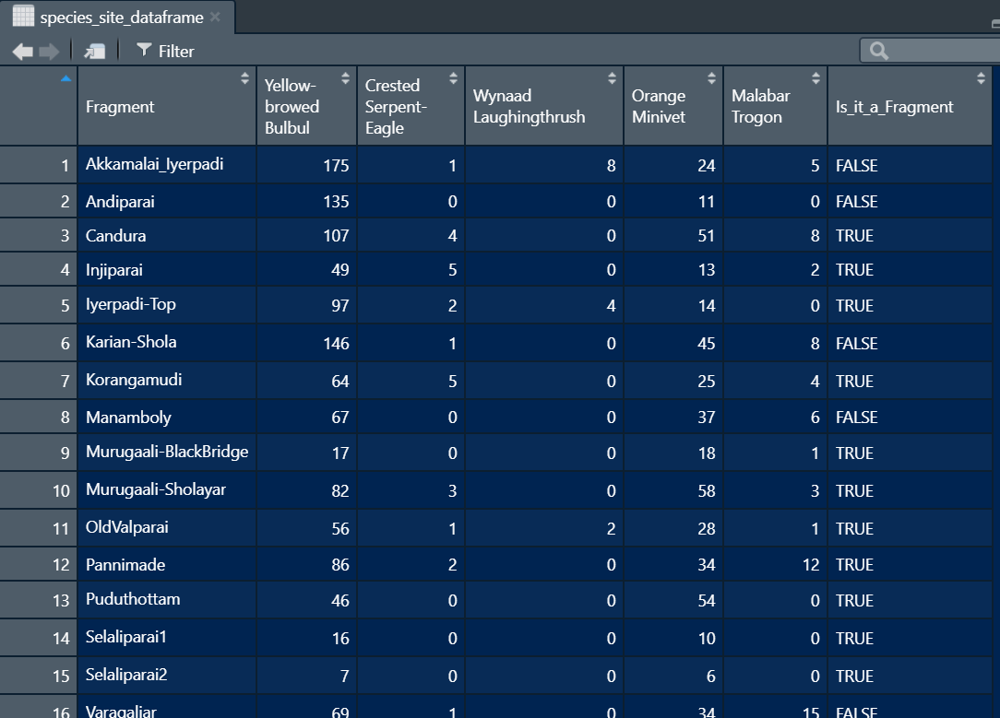
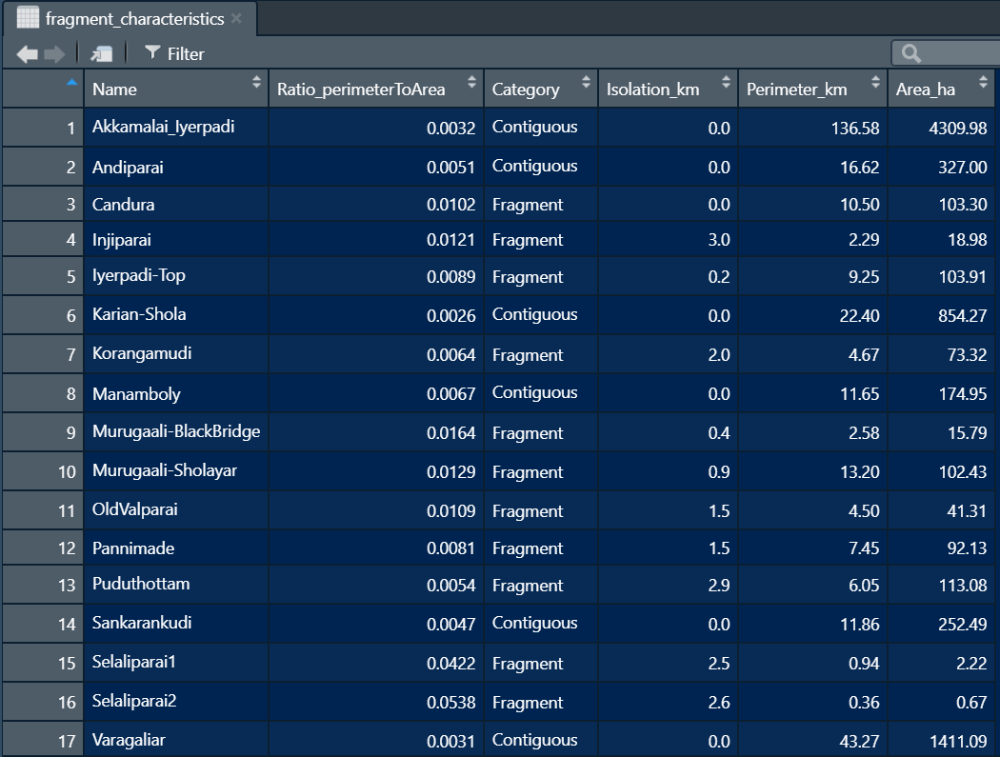
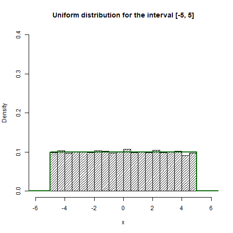
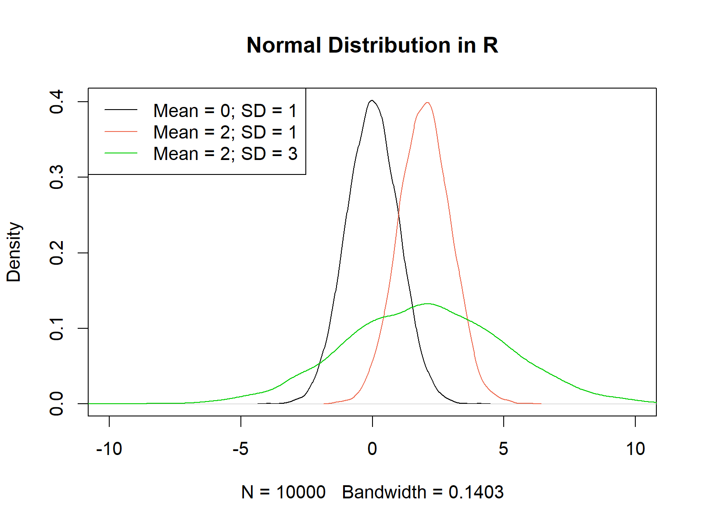

```{r setup, include=TRUE, echo=FALSE, eval=FALSE,fig.width=4,fig.height=4}
knitr::opts_chunk$set(echo = TRUE)
```

This worksheet comprises explanatory text, worked examples and problems for solution. Please feel free to discuss any and all of it with your classmates, but do work independently on your solutions.

**Topics covered**: 

**Interactive session 1**: 9th October 2020, 09:00AM -11:00AM IST

**Interactive session 2**: 14th October 2020, 09:00AM -11:00AM IST

**Submission deadline**: 15th October 2020, 11:59PM IST

**Submission**: Save your final R script in the format ‘first name_last name_WS04.R’ and email this file to
both Anand (\underline{aosuri@ncf-india.org}) and Akshay (\underline{akshaysurendra1@gmail.com}) by the given deadline.

Throughout this worksheet, we will be using three datasets, all from one paper by [Davis et al 2018 (Ecology Letters)](https://onlinelibrary.wiley.com/doi/abs/10.1111/ele.13124). Two of the datasets can be found [here](https://datadryad.org/stash/dataset/doi:10.5061/dryad.7f9j57n) and the third is in the supplementary section. If you cannot access the paper, maybe try \underline{sci-hub.se} and paste the link in here and see what happens? Someone told us this works very well.

Before we proceed, import the files `tab1_species.csv`, `tab2_cooccurence.csv` and `tab3_traits.csv` and assign them to objects **tab1**, **tab2** and **tab3** respectively. Use the `str()`, `head()`, `tail()` and `glimpse()` (what's this function? try it out!) functions to explore what each of the datasets are.

```{r message=FALSE}
library(tidyverse)

tab1 <- read_csv(file = "datasets/tab1_species.csv")
tab2 <- read_csv(file = "datasets/tab2_cooccurence.csv")
tab3 <- read_csv(file = "datasets/tab3_traits.csv")

```

About these data:

These data are camera trap records from Nepal of 7 co-occurring mammals. `tab1` has a table of all 7 mammal species, `tab2` has information on 78 different sites within Nepal (`NEP01` to `NEP78`) - in each site, there are 21 (7C2 = 7x6/2) rows, for every possible pairwise combination within the 7 mammals. Each of the 21 rows per site have two columns indicating the code for each of the species (`SppCode1` and `SppCode2`), number of detections (sightings) of each species (`Spp1Det` for species 1, `Spp2Det` for species 2), and the number of trap nights (`num.nights`) that the camera trap was active. `tab3` has information on the traits of each species pair (i.e. 21 rows).

In summary, these data together inform us of how often two species of mammal are photographed at the same camera trap location.


In this worksheet, we will learn:

  1. Conditional statements
  2. Joining data frames
  3. Random number generation
  4. Sampling
  5. Looping statements
  
## 2.1 conditional statements

We've learnt how to use relational operators to create a subset of the data:

```{r}

library(tidyverse)

set.seed(10)
dat <- data.frame(col1 = rnorm(n = 100,mean = 0,sd = 2))
vec_A <- dat %>% filter(abs(col1) > 0.5) %>% pull(col1)
vec_B <- log10(x = abs(vec_A))

```

The above snippet of code filters all values in the column col1 of dataframe dat that are greater than 0.5 or less than -0.5 (how? using the `abs()` function - `abs()` takes the absolute value of the column, converting all negative numbers to positive temporarily while comparing with 0.5). We can then perform a particular task on that subset - in this case, we take a logarithm of base-10 of these data.

[Q Why might we be taking an absolute value here again?]

What if, however, we want to perform different tasks on different subsets of data?

```{r}
datA <- tibble(colA = c("X","Y","X","Y","Y","X","X","Y","X"),
               colB = c(10, 17, 21, 99, 444, 87, 7, 33, 45))

```

For example, in datA above, we may want to find the mean of `colB` if `colA` is X and the median of `colB` if `colA` is Y. We can do it this way - 
```{r}
r1 <- datA %>% filter(colA=="X") %>% summarize(res = mean(colB)) %>% pull(res)
r2 <- datA %>% filter(colA=="Y") %>% summarize(res = median(colB)) %>% pull(res)
c(r1,r2)
```

What if we have many conditions? For example - if A is true, do this; or if B is true, do that; or if C is true, do something else; or if D is TRUE, then do a fourth thing, and so on...

This is where some key conditional statements come in: `if()`, `ifelse()` and `case_when()`

  1. `if()` statement
  
```{r}
temp <- c(5,6,6,5)
chk <- temp==5

if(chk[1]==TRUE)
{ print("yep, chk[1] is five")}
if(chk[2]==TRUE)
{ print("yep, chk[2] is five")}
if(chk[3])
{ print("yep, chk[3] is five")}
if(chk[4])
{ print("yep, chk[4] is five")}

```

An `if()` statement takes an input value that can be `TRUE` or `FALSE`. If `TRUE`, it implements the code contained within the curly braces *immediately* below the `if()` statement. If it's `FALSE`, it skips the *block of code* (the correct term for "whatever is between curly braces") right beneath

In the above code,  *"yep, chk[...] is five"* is only printed when `chk` is TRUE, or when `temp==5` - the block of code is not printed when `temp!=5` or `chk` is `FALSE`

*\underline{Note: In R, `if(chk==TRUE)` is the same as `if(chk)`}*

We usually don't store `TRUE` or `FALSE` values in an object (`chk`), we directly test that within an `if()` statement: `if(temp==0)`. We can rewrite the above conditional statement as:

```{r}
if(temp[2]==6){
  print("yep, it is a six")
}
```

What if we want to do is run some other task when the condition is something else? We can then have two `if()` statements:

```{r}
if(temp[1]==5){
print("yep, temp[1] is a five")
}

if(temp[3]!=5){
print("nope, temp[3] is not a five")
}
```

Often, we may want to perform different tasks depending on whether a condition is TRUE or FALSE. For example, printing different outputs depending on whether a condition evaluates as TRUE (say `temp[1]==5`) or FALSE (say `temp[1]!=5`). In such cases, we use an `ifelse() {}` statement. 
*Remember, `!=` is the symbol to test NOT EQUAL TO just as `==` is the symbol to test EQUAL TO*

The `ifelse()` syntax is a little different:
```{r}
len <- 6
temp1 <- c(5,5,6,6,5,6)
temp2 <- vector(mode = "character",length = len) # alit. way of defining a vector
temp3 <- temp2 # creating another empty vector
temp2[1] <- ifelse(test=(temp1[1]==5), yes="yes, it's 5", no="no, it's not 5")
temp2[2] <- ifelse(test=(temp1[2]==5), yes="yes, it's 5", no="no, it's not 5")
temp2[3] <- ifelse(test=(temp1[3]==5), yes="yes, it's 5", no="no, it's not 5")
temp2[4] <- ifelse(test=(temp1[4]==5), yes="yes, it's 5", no="no, it's not 5")
temp2[5] <- ifelse(test=(temp1[5]==5), yes="yes, it's 5", no="no, it's not 5")
temp2[6] <- ifelse(test=(temp1[6]==5), yes="yes, it's 5", no="no, it's not 5")
temp2

# vectorized:
temp3 <- ifelse(test = (temp1==5),yes="yes, it's 5",no="no, it's not 5")
temp3

```

`ifelse()` takes three arguments, a test condition, and two tasks: one when the condition is `TRUE` (yes) and another when the condition is `FALSE` (no)

If we have multiple conditions? What do we do then? *Nested* `ifelse()` statements:

```{r}
len <- 21
temp6 <- vector(mode = "character",length = len) #alit. way of defining a vector
temp5 <- c(rep(6,3),rep(7,9),rep(81,5),rep(44,4))

temp6 <- ifelse(test = (temp5==81),
                yes =  "yep, it's an 81!",
                no = ifelse(test = (temp5==44),
                            yes = "yep, it's 44!",
                            no = "it's neither 44 nor 81 :("))
```

As you can imagine, you can add many levels of nested `ifelse()` statements to implement tasks when certain conditions are true or not. It's easy to see that you need - 
  1. one `ifelse()` with two tasks
  2. two `ifelse()` with three tasks
  ... or K `ifelse()` statements to do K+1 tasks

In practice, beyond one level of nesting, it's often easier to implement a `case_when()` statement. The syntax for `case_when()` is:

```{r}
# case_when(
# <test1> ~ <task1>,
# <test1> ~ <task2>,
# <test1> ~ <task3>,
# ...)
# We can implement the above example with this syntax:

temp6 <-
  case_when(
    temp5==81 ~ "yep, it's an 81!",
    temp5==44 ~ "yep, it's an 44!",
    temp5==7 ~  "yep, it's an 7!",
    temp5!=81 & temp5!=44 & temp5!=7 ~ "None of the above (NOTA)")
temp6

```

Because `case_when()` belongs to tidyverse, you can use these within pipes, say within a `mutate()` to create a new column based on certain sets of conditions.


  
## 2.2 Joining tables together

In many instances, data that you will use in your analyses will be located across many different spreadsheets. For example: 





`data frame A` has information on birds seen per fragment, and `data frame B` has information on each fragment itself. It's useful to store data this way, but sometimes, we may want to use them together. For instance, we may want to plot and see how the number of Yellow-Browed Bulbul (in `data frame A`) varies with the size of fragment (in `data frame B`).

To achieve this, we can **join** tibbles together using the `left_join()` function illustrated below:

```{r echo=TRUE,eval=TRUE}
dat1 <- tibble(fragment = c("AK","AN","CA"),
               ybbulbul = c(18,11,29))

dat2 <- tibble(fragment = c("AK","AN","CA"),
               size = c(1145.5, 600,105))

dat3 <- left_join(x = dat1,y = dat2,by = "fragment")
dat3
```

The function `left_join()` takes three arguments: the first data frame (x), the second data frame (y) and the column name (*in quotes*) by which to join. R is smart, in that if you don't provide the column name, it will auto detect all common columns (by the name) and join by those.

What if joining columns have different names, for instance, if dat1 is defined this way:
```{r}
dat1 <- data.frame(location = c("AK","AN","CA"), ybbulbul = c(18,11,29))
#notice, that it is location and not fragment
```
In such a case, we use a slightly different syntax for joining:
*`left_join(x = <firstdataframe>, y = <seconddataframe>, by=c("<columnname_1stdataframe>" = "<columnname_2nddataframe>"))`*

```{r}
dat3 <- left_join(x = dat1,y = dat2,by = c("location" = "fragment"))
```

You will almost always encounter these two scenarios:

1) When matching columns that don't completely overlap, you will see - 
```{r}
dat1 <- data.frame(fragment = c("AK","AN","PM"),
                   ybbulbul = c(18,11,29))

dat2 <- data.frame(fragment = c("AK","AN","CA"),
                   size = c(1145.5, 600,105))

dat3 <- left_join(x = dat1,y = dat2,by = "fragment")
dat3
```
- how everything in dat1 has been retained, but only common elements from dat2 have been joined.

What happens when you replace `left_join()` with `right_join()`?
```{r eval=TRUE}
right_join(x = dat1,y = dat2,by = "fragment")
```
The opposite happens: all cases in y are retained and only matching cases from x are joined.

What happens when you use `full_join()` instead?
```{r eval=TRUE}
full_join(x = dat1,y = dat2,by = "fragment")
```
All cases are printed - those without matches in each other's data frame are replaced with NA

2) when one data frame has repeated values of one or more cases and the other doesn't

Just as in scenario 1), you can intuit what happens. For e.g., consider two point counts in each fragment in `dat1`, and join this new `dat1` with the same dataframe `dat2`:
```{r}

dat1 <- data.frame(fragment = c("AK","AK","CA","CA"),
                   pointCount = c("AKP1","AKP2","CAP1","CAP2"),
                   ybbulbul = c(18,11,29,34))

dat2 <- data.frame(fragment = c("AK","AN","CA"),
                   size = c(1145.5, 600,105))

dat3 <- left_join(x = dat1,y = dat2,by = "fragment")
dat3
```
Here, all rows with the same case in `dat1` (either `AK` or `CA`) are matched with the fragment column (and other columns) in `dat2`: if you had more columns in dat2, those would get mapped on to `dat1` as well. Notice how `AN` in `dat2$fragment` has no matching case in `dat1` and therefore gets ignored.
However, what happens instead when you replace `left_join()` with `full_join()`? 

#### Practice:
(do not submit this, we can discuss in class)

In the Nepal mammal occurrence datasets provided, `tab2` contains many rows for each species pair (`Spp1` or `Spp2`) and `tab1` contains information on each species. Our aim is to join these two datasets, such that the output is as long as `tab2`, and contains all columns from `tab2` and `tab1`


  a) Identify the column(s) with common cases in `tab1` and `tab2`
  b) Use the appropriate join function() and `by = ` argument to join `tab1` and `tab2` together
  c) what happens when you don't provide any `by = ` argument? What do the join function(s) join by?
  d) You realize that not all columns from `tab1` are needed in the final data frame. Can you select the weight and common name of each species in `tab1` alone & then join? Which other column from `tab1` is compulsory?
  e) Try the other 2 join functions (besides what you used in `b.` above) and see what you get


## 2.3 Random numbers 

Of what use are random numbers? In ecology, as indeed in science in general, we can often understand something about patterns generated by a particular process by making comparisons against a null model, which correspond to patterns that we might expect in the absence of that process. It might not be practical to find these null models in the real world (e.g., in a study on climate change, to find a 'null' planet similar to Earth but one that is not experiencing climate change), leaving us no better option than to recreate them using computer simulations. Random number generation is fundamental to such procedures.

In R, we generate random numbers from distributions. Two commonly used distributions are rnorm() (random-normal pronounced ar-norm) and runif() (random-uniform or ar-you-nif). `runif()` draws random numbers from a uniform distribution within a specified range. In a uniform distribution, all candidate numbers have an equal probability of getting selected (see the uniform distribution histogram below). runif() thus requires three arguments: `n =` number of random numbers to be drawn, and `min =` and `max =`  define the range within which we want to select a random number. By default, `min = 0` and `max = 1`.

rnorm() draws values from a normal or gaussian distribution, which is characterised by a central value (mean) and spread surrounding the central value (standard deviation) (see the lower panel below). Here, for a given spread of data, values that are closer to the mean have a greater probability of being selected than those farther away. 





To draw 45 random numbers from a uniform distribution between 8 and 900, we run:

```{r eval=TRUE}
set.seed(20)
obj1 <- runif(n = 45,min = 8,max = 900)
obj1
```

If you want to generate whole numbers only, you can simply round off to the nearest whole number with the `round()` function. A `round()` function takes two arguments, `x =` the object that needs to be rounded and `digits =` number of decimal digits to be rounded to; `digits = 0` (default) will return a whole a number:

```{r}
set.seed(20)
obj1 <- runif(n = 45,min = 8,max = 900)
round(x = obj1) # same as round(x = obj1, digits = 0)
```

You can imagine that values between 0 and 0.5 become 0 and between 899.5 and 900 become 900, such that with a round() function, you'll get both `min=` and `max=`
How will you generate random *whole numbers* that do **not** include (i) `min=` value (ii) `max=` value (hint: read up `ceiling()` and `floor()` functions)

Each time you run `runif()` you will get a different set of numbers. This can be annoying, when you want to use the exact same set of random numbers. You can save those numbers in an object and use that object, and that object's contents won't change as long as you don't re-run the `runif()` statement. However, if you share your code with someone else or if you restart your RStudio session, you will get a new set of numbers.

To prevent this, we can do what is called *setting seed*, using the `set.seed()` function:

```{r}
set.seed(45)
round(runif(4,min=0,max=5))
```

You will get the exact same set of numbers, as long as the number within set.seed() function is the same (you can give any number within `set.seed()`. If you're curious, you can read more [here](https://stackoverflow.com/questions/13605271/reasons-for-using-the-set-seed-function).

#### Practice:
(do not submit this, we can discuss in class)

Generate 50 random numbers between 5 and 10 that are whole numbers and store as C1. Generate another 50 numbers (5-10) rounded to 1 decimal place and store as C2. Repeat the above process to generate C3 and C4 respectively, except this time, exclude the minimum value 5 and set a common seed for both. Bind them together as a matrix and then convert it to a tibble. Now use `pivot_longer()` to transform the data and using the old column names (now IDs for each random sample), plot four histograms faceted into 4 sub plots in one row.


## 2.2 Sampling

While the previous section dealt with creating random samples based on some theoretical distributions, your analyses might sometimes require you to draw random samples from within your own dataset.

In R, we sample or subsample data using the `sample()` function. It takes four arguments:

  1. `x = `vector of elements from which to sample from (population), compulsory
  2. `size = `number of elements to sample from **x**; if you don't supply size, it resorts to the default value: `size = length(x)`
  3. `replace =` takes `TRUE` or `FALSE` values i.e. `with` or `without` replacement; default is `FALSE`; more on replacement [in this video](https://www.youtube.com/watch?v=dQ9r2S7NWLs)
  4. `prob =` probability of each element in x; default value is equal probability for each element in x (this is usually what we want)

```{r}
set.seed(567)
sample(x = c(5:7))
```

```{r}
set.seed(567)
sample(x = round(runif(n = 5)))
```

In both examples above, size is default (length(x) = 3 or 5), replace is default (FALSE) and probabilities are equal.
Each time you run this, all elements in x are returned,  but in a different order (watch the video on sampling to make sense)


```{r}
set.seed(567)
sample(x = round(runif(n = 5),1),size = 3)
# Same as: # sample(x = round(runif(n = 5),1),size = 3,replace = FALSE)
```

```{r}
set.seed(567)
sample(x = round(runif(n = 5),1),size = 3,replace = TRUE)
```

We sample 3 numbers from a population of 5 numbers, and each time we get a different element in case one (can still be the same number if that number repeats) while we may get the *same element* in case two


#### Practice:
(do not submit this, we can discuss in class)

In tab2, we have a column called site with information on 78 different sites (`NEP01` to `NEP78`). Select rows corresponding to site `NEP60` and store that data in an object `qsam1`. Then, filter out all rows with tiger or leopard in the `SppCode2` column (look up code in `tab1`) and store in `qsam2`. Then, sample the `Spp2Det` column in `qsam2`, with replacement and with `nrow` equal to the total number of rows in `qsam2`. Find the mean of this sample. Now repeat this sampling of the same `Spp2Det` column in `qsam2` another 6 times, and find the mean each time. Report a boxplot of those 7 values.


## 2.3 Looping

The practice question in 2.2 was laborious. What if instead of 7 times, we wanted to repeat the sampling 50 times? 100 times? 1000 times?

This is where looping comes in. *A loop is a way to repeat a set of statements many, many times.* 

Let's assign numbers 1 through 12 to a vector `vec1`: 

```{r}
vec1 <- vector(mode = "numeric",length = 12)
vec1 <- c(1:12)
```

Here, R is automatically going through each element in vec1 and assigning the numbers 1 through 12 to the consecutive elements (vectorized operation). A loop generalizes this procedure, and when R cannot vectorize something, you can do it manually. Besides, loops let us do a lot more things.

To repeat the above assignment, we can use a `for()` loop (for illustration only; generally there is no need to do this using a loop):

```{r}
for(j in 1:12)
{ 
  vec1[j] <- j
}
```

What's happening here?
  - The set of lines enclosed in braces or curly brackets {} are repeated, with j holding a different value each time {...} is run
  - Immediately above the curly brackets is the `for()` *loop* (not a function even though it has parentheses)
  - The `for()` loop specifies the looping variable as `<indexobject> in <vector>` where `in` is a special text that is compulsory
  - On seeing a `for()` statement, R first identifies the looping variable (j) and the looping vector `(1:12)`. Then, R replaces j with the first element in the iteration vector, runs the block of code {}, moves j to the second element in the iteration vector, runs the same block of code {} but with *a different value of j*, moves j to the third element in the iteration vector... and so on. When it reaches the end of the vector sequence, it stops *looping* and exits this block of code.

Let's see some examples:

Example 1:
Here, the output vector `vec2` holds some combination of the index variable - 

```{r}
vec1 <- vector(mode = "numeric",length = 9)
# this is another way to define a vector:
# mode specifies the data type in double-quotes, and
# length specifies how many elements the vector contains

# vec1 <- NULL
# when you don't know how long your vector is,
# we can do this as a safe option: note that vec3 is not a vector,
# it's just an empty object

for(j in 1:9)
{
  vec1[j] <- j*2
}
```

Example 2:
We're printing some combination of the looping variable, `vec2` is not required - 

```{r}

vec2 <- vector(mode = "numeric",length = 9)
for(j in 1:9)
{
  print(x = paste("Currently on",j,"th index and square-root of the index is",sqrt(j))) 
}
```

Q. What does the `paste()` function do? what about the `paste0()` function?

Example 3:
Here, contents of our output vector `vec2` is not related to the index variable; the looping variable is only used to extract the value from the index of another object, in this case, `random_nos` - 

```{r}

vec3 <- vector(mode = "numeric",length = 9)
tmp1 <- runif(n = 9,min = 50,max = 52)
random_nos <- round(x = tmp1,digits = 1)

for(j in 1:9)
{
  vec3[j] <- random_nos[j]
}
```

Notice how `9` is repeated thrice: once when creating the output vector holder `vec3`, once when defining the input vector `random_nos`, and a third time in our loop. It's always good practice to provide this information programmatically like so:

```{r}
len <- 9
vec3 <- vector(mode = "numeric",length = len)
tmp1 <- runif(n = len,min = 50,max = 52)
random_nos <- round(x = tmp1,digits = 1)

for(j in 1:len)
{
  vec3[j] <- random_nos[j]
}
```

We can simply change the number assigned to object `len` and we will get a different output

Example 4:
Here, j runs through a sequence that *cannot* be used as an index element for any vector - 

```{r}
for(j in seq(from = 0.1,to = 0.9,by = 0.1))
{
  print("This is a rather contrived example",j)
} 
```

Why can't we use the looping variable here?

Example 5:
The iteration vector can be a character vector as well:

```{r}
for(j in c("I","like","a","potato"))
{
  print(j)
} 
```

Here's some reason to rethink our love for potatoes [video](https://ruralindiaonline.org/articles/the-potato-song/)

Rule of thumb: If you're running a loop where the output has to be saved in successive elements in an object, use a sequential index starting from 1 and going up to the length of the object

There are two other loops - `while() {}` and `repeat {}` - as well as two other loop controls (`break` and `next`) that are useful in some situations. Another related concept is nested loops - one loop within another. you can go over all of these [here](https://www.datacamp.com/community/tutorials/tutorial-on-loops-in-r). Of these, nested loops is the most useful additional concept and we can discuss that in class, while other topics are good to know but may be less important.

#### Practice:
(do not submit this, we can discuss in class)

Practice joining data frames by joining tab3 with tab2, *using `Spp1` in `tab3` and `Spp1Code1` in `tab2`*. Then, run a loop over each row in the resulting data frame, and count how many rows have both Spp1Det and Spp2Det equal to zero. In each of those rows, add up the `MeanBodySize` while running the loop over each row of the dataframe (both these need counter variables: they are defined as zero outside the loop and in the loop, their value is updated each time: e.g., `counter = counter + 1` adds 1 to the counter each time the block of code is run). To identify what fraction of rows were zero and what the average `MeanBodySize` was, can divide both the counter variables by the number of iterations - i.e. the number of times the loop is run, length of the iteration vector.


\newpage

# Problem Set

The problem set is built around a dataset of tree species occurrences within three habitats. While the dataset itself is not real, it is inspired by real species and places. Import the file *`prob_set_data.csv`* and store it within an object named `treedat`. Each row corresponds to individual trees of different Species recorded within three Habitats -- `Type_1`, `Type_2` and `Type_3`

  1. We need to add a column describing the year during which each habitat type was sampled.
  `Type_2` was sampled in 2017, and `Type_1` and `Type_3`  during 2018. Can you add this information to the tibble using `mutate()` in conjunction with a conditional statement? Call the new column `Year_conditional`
  
  2. Can you also achieve the above task using a join function? In this case, call the new column for year `Year_join` [hint: first, create a new tibble
  `Year_tib <- tibble(Habitat = c(“Type_1”, “Type_2”, “Type_3”), Year_join = c(2018, 2017, 2018)` ]
  
  3. Using what you have learned previously in `dplyr`, generate a table reporting the number of trees recorded within each habitat type (i.e., the numbers of rows of data within each habitat type) [hint: `group_by()`, `summarize()`]
  
  4. Again, using `dplyr` functions, generate a table reporting the number of species recorded in each habitat type. Also generate a bar graph showing the species richness of the three habitats. [hint: `n_distinct()`]
  
Can you comment on which of the three habitats harbours the most species? Based on raw counts, you may notice that Habitat `Type_2` has the most species, followed by `Type_3` and then by `Type_1.` You may also notice a similar ranking in terms of overall counts of trees (`Type_2` > `Type_3` > `Type_1`). In making comparisons between habitats, sometimes we may be more interested in knowing the numbers of species for a given number of individuals in each habitat, than in the overall counts of species per habitat. This approach is called **individual-based rarefaction**.

  5. Use `dplyr` tools to create a subset of the dataset comprising only data from habitat `Type_1`. Store this in an object `habitat_1`. From within `habitat_1`, select a random sample (without replacement) of 50 individuals, and count how many species this sample contains. Repeat the selection step five times, and as a comment in your code report the number of species present in each selection. Do you get the same number of species each time?
  
  6. As above, create data subsets corresponding to habitat `Type_2` and `Type_3`, and name them `habitat_2` and `habitat_3`, respectively. Use a `for()` loop to perform 100 iterations of individual-based rarefactions for each habitat. In each iteration, draw a sample of 50 individuals and count the numbers of species contained within the sample for each habitat. Plot the comparison of rarefied species richness across the three habitats using a boxplot.

Bonus question: Create a graph showing the rate of accumulation of species as more individuals are sampled in the three habitats. Use a `for()` loop with 100 iterations to estimate the average number of species obtained per 25, 50, and 75 individuals sampled in each habitat. Make a line graph showing the three species accumulation curves.
